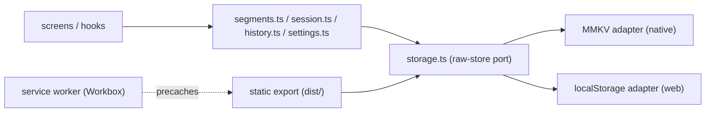

# Architecture Spine — Web platform support

## Design Paradigm

**Storage: ports-and-adapters, one port.** `storage.ts`'s raw store is the port; MMKV (native) and `localStorage` (web) are its only two adapters, selected once at module load by `Platform.OS`, never at call time. Everything above the port (`getObject`/`setObject`, `migrate`, `quarantine`, and every consumer from `segments.ts` up through screens) depends only on the port's contract, never on either adapter directly.

**Web delivery: static export + cache-first shell.** The web build is a static file tree (`expo export --platform web`) served by a static host, fronted by a service worker that precaches that same tree for offline-after-first-load. No server-side logic exists or is introduced; the app's zero-backend, zero-account posture is unchanged by going to web.



## Invariants & Rules

### AD-1 — Storage stays a single port; `react-native-mmkv`'s own web build is the web adapter [ADOPTED, amended 2026-09-14]

- **Binds:** `src/lib/storage.ts`, and by extension every consumer above it (unchanged).
- **Prevents:** a parallel/divergent storage implementation for web; any call site needing to branch on platform itself; hand-rolling an adapter that duplicates what the pinned dependency already provides.
- **Rule:** `src/lib/storage.ts` needs **no** `Platform.OS` branch and **no** hand-rolled adapter. `react-native-mmkv@4.3.2` (pinned, unchanged) ships `createMMKV.web.ts`, which Metro's platform-file resolution substitutes automatically for web bundles — a complete `localStorage`-backed implementation covering construction and every raw-store method `storage.ts` uses. Verified empirically (2026-09-14): `npx expo export --platform web` against the real, unmodified `storage.ts` built clean; the bundle contains the web module's `mmkv.default` key prefix and `getLocalStorage`, proving Metro picked the real web implementation. `getObject`/`setObject`, `migrate`, `quarantine`, and the versioned-envelope/quarantine conventions are reused unmodified for both platforms, unaffected by this. (Originally specified as a hand-rolled `Platform.OS`-gated adapter with construction-timing gating — amended once build investigation found that duplicates existing, already-correct dependency behavior.)

### AD-2 — `subscribeToKeys` fan-out is synchronous, isolated, and cleanly unsubscribable [ADOPTED, amended 2026-09-14]

- **Binds:** `src/lib/storage.ts`'s web behavior (via the dependency, not this codebase).
- **Prevents:** listener leaks across test runs / component lifecycles, and one throwing subscriber breaking sibling notifications or the write path.
- **Rule:** `react-native-mmkv@4.3.2`'s web build already provides this: an in-module listener `Set`, fired synchronously on every `set`/`remove` from `callListeners()`, with `addOnValueChangedListener` returning a `.remove()`-bearing handle — read directly from the dependency's source (`createMMKV.web.ts`). No code in this repo needs to implement fan-out. **Not yet verified:** per-listener error isolation (one throwing subscriber blocking siblings) — the dependency's `listeners.forEach((l) => l(key))` has no per-callback try/catch, so this may not hold as originally specified; confirm with a test before relying on it, and treat as a `deferred-work.md` entry against the dependency if it doesn't. (Originally specified as an in-module `Set` this codebase would build; amended once build investigation found the dependency already implements it.)

### AD-3 — One base path threads router, manifest, and service worker scope [amended 2026-09-14]

- **Binds:** Expo Router base URL config, `app.json`'s PWA `start_url`/`scope`, `dist/service-worker.js` registration scope.
- **Prevents:** the three configuring the deploy path independently and drifting apart (e.g. router resolves assets at `/`, manifest expects `/Overlearn-App/`) — including each being implemented via a *different mechanism* (a literal string in one, an env var under a different name in another) while each individually looks AD-compliant.
- **Rule:** exactly one named config key is the source of truth: `app.json`'s `expo.experiments.baseUrl`. The router config, the PWA manifest fields, and the service worker's registration (AD-8) all read this same key directly — none re-derives or hardcodes the path independently. Set to the GitHub Pages subpath (e.g. `/Overlearn-App/`) for now. Revisit as one coordinated change to this single key, not three separate ones, if a custom domain is attached later (value becomes `/`). (Originally specified as `expo.extra.basePath` — amended once build investigation (Story 6.2) found `@expo/cli`'s static-export pipeline never reads that key; `experiments.baseUrl` is the key `getBaseUrlFromExpoConfig` actually applies to routing and asset URLs.)

### AD-4 — Deep links past the root are client-rendered, not statically prerendered

- **Binds:** `segment/[id]`, `segment/[id]/rename`, `session/[id]`; the GitHub Pages SPA-routing fallback (e.g. `404.html` → app shell).
- **Prevents:** treating the fallback rewrite as optional/conditional (confirmed non-optional: these routes' ids are created locally by the user at runtime and are unknowable at build time, so no static HTML can exist for them ahead of time — they resolve client-side against `localStorage` after the shell loads), and two incompatible fallback mechanisms being built by different implementers (a plain-copy `404.html` vs. a query-string-redirect trick are not interchangeable and only one is the standard GitHub Pages pattern).
- **Rule:** the fallback mechanism is pinned to GitHub Pages' standard plain-copy pattern — `dist/404.html` is a byte-identical copy of the built `dist/index.html` — generated in the *same* postbuild step that generates the service worker (AD-5), never hand-committed. That step is `404.html`'s sole owner; nothing else writes or maintains it. **`404.html` covers the online case only**: once the service worker is installed it intercepts navigations before the host can answer, so deep-link routing offline is the service worker's responsibility, not `404.html`'s — see AD-5's `navigateFallback` rule. (Amended 2026-09-15, Story 6.3 review: the original rule left the offline half of deep-link routing unowned, so an offline reload of `/segment/<id>` matched no precache entry and failed.)

### AD-5 — Service worker precache is generated, not hand-maintained, via Workbox

- **Binds:** `dist/service-worker.js`, a new `workbox-build` devDependency, the `expo export` → service-worker postbuild step.
- **Prevents:** hand-rolled cache-versioning/activate-eviction bugs — a stale `index.html` referencing a since-removed hashed bundle after a redeploy.
- **Rule:** `workbox-build`'s `generateSW` runs as a postbuild step against the real static-export output (`dist/`); the precache manifest is never hand-maintained. Its `globPatterns` must match 100% of `dist/`'s real output (icons and `manifest.json` included, not just JS/CSS) — the postbuild step asserts the precached file count equals the `dist/` file count (minus an explicit, named ignore list) and fails the build on mismatch, so a silently-excluded asset (e.g. a manifest icon) can't ship undetected. Pin the exact installed version in `package.json` (verified current: `7.4.1`, Google-maintained, MIT, active release cadence — see sources). `maximumFileSizeToCacheInBytes` is set explicitly (4 MiB) rather than left to Workbox's 2 MiB default — the main JS bundle is ~2.0 MiB and growing, and an unowned default that silently drops the largest asset would break this rule's own 100%-precached invariant. `navigateFallback: 'index.html'` (with `_expo/` denylisted) makes the worker serve the app shell for any navigation it has no precache entry for, which is what makes AD-4's deep links work *offline*; `404.html` only covers the online case. Update lifecycle uses Workbox's own default (no `skipWaiting`/`clientsClaim`): a newly deployed worker activates only once every tab running the old version has closed, so an in-progress practice session is never swapped under itself. The whole pipeline (`web:manifest` → `expo export --platform web` → 404.html copy → `generateSW`) is one canonical `package.json` script (`build:web`), run identically for local verification and by CI (AD-6) — never two separately-maintained invocations that can silently diverge. (Amended 2026-09-15, Story 6.3 review: added the explicit size cap and `navigateFallback`; corrected the pipeline description, which omitted the `web:manifest` step the shipped script begins with.)

### AD-6 — Deploy via GitHub's native Pages Actions, triggered manually

- **Binds:** `.github/workflows/deploy-pages.yml`.
- **Prevents:** an extra `gh-pages` branch to reason about and a third-party action in the trust chain where a first-party equivalent exists; and an untriggered deploy on every merge to `main` when release timing should be a deliberate choice, matching Android's own manual EAS build/submit cadence rather than firing on every commit.
- **Rule:** build with `expo export --platform web` (+ the Workbox postbuild step), publish via `actions/upload-pages-artifact` + `actions/deploy-pages`, triggered manually (`workflow_dispatch`) against `main` — never automatically on push. A human decides when the web build actually ships, same as Android.

### AD-7 — No backend, accounts, or telemetry introduced to support web

- **Binds:** the whole web-delivery surface (hosting, PWA, storage).
- **Prevents:** hosting or installability work quietly growing a server, an account system, or analytics that the app's local-only, zero-telemetry posture doesn't have on native.
- **Rule:** GitHub Pages serves static files only; the service worker caches those same static files; nothing in this scope talks to a server the app doesn't already not have.

### AD-8 — Service worker registration has one named call site, default scope

- **Binds:** the boot-time `navigator.serviceWorker.register()` call.
- **Prevents:** two implementers each assuming the other owns registration (so it never ships) or both adding it (double-registration, or a scope conflict if either passes an explicit `scope`).
- **Rule:** registration lives in exactly one file (the web entry point / root layout's web-only boot path), called once. No explicit `scope` option is passed — it defaults to the service worker file's own location under the base path (AD-3), which is already correct by construction. The registered **script path is absolute, built from AD-3's base path** (`` `${baseUrl}service-worker.js` ``) — never a bare relative path. (Amended 2026-09-15, Story 6.3 review: the original rule assumed a relative path "resolves correctly by construction", but the static export emits no `<base>` tag, so a relative path resolves against the *document*. A visitor whose first load was a deep link — `/Overlearn-App/segment/abc`, served by the 404.html fallback with the deep URL preserved — requested `/Overlearn-App/segment/service-worker.js`, got a 404, and was left permanently without offline support. Passing no explicit `scope` remains correct and unchanged.)

## Consistency Conventions

| Concern | Convention |
| --- | --- |
| Naming | Service worker at `dist/service-worker.js`; SPA-routing fallback at `dist/404.html` (both computed from the real post-export `dist/` output by the postbuild step — corrected 2026-09-14 during Story 6.3; see AD-4/AD-5); deploy workflow at `.github/workflows/deploy-pages.yml` |
| Data & formats | Storage envelope/quarantine format unchanged, shared across platforms (AD-1). Base path is one config value referenced by router, manifest, and service worker registration (AD-3) — never a literal repeated in three places |
| State & cross-cutting | Listener fan-out: synchronous, per-listener error isolation, explicit unsubscribe (AD-2). Service worker updates: conservative, no forced takeover mid-session (AD-5) |

## Stack

| Name | Version |
| --- | --- |
| expo | ~57.0.18 |
| expo-router | ~57.0.17 |
| react-native-web | ~0.21.0 |
| react-dom | 19.2.3 |
| workbox-build (new, devDependency) | 7.4.1 — verify current at install time |

## Structural Seed

```text
dist/
  service-worker.js   # Workbox-generated, postbuild (not committed -- build output)
  404.html            # SPA-routing fallback -> app shell (not committed -- build output)
.github/
  workflows/
    deploy-pages.yml  # expo export --platform web -> Workbox postbuild -> Pages deploy
src/
  lib/
    storage.ts         # raw-store port + Platform.OS adapter selection (AD-1, AD-2)
```

**Deployment & environments:** single environment (GitHub Pages, `main` branch triggers deploy) — no staging tier for this scope. Host: GitHub Pages, subpath `github-username.github.io/<repo>/` (AD-3). No server-side compute anywhere in this surface (AD-7).

## Capability → Architecture Map

| Capability / Area | Lives in | Governed by |
| --- | --- | --- |
| Web storage parity | `src/lib/storage.ts` | AD-1, AD-2 |
| Durability doc addendum | `prd.md` NFR8/9 | (doc-only, no AD) |
| Installability / offline shell | `app.json`, `dist/service-worker.js`, web entry point (SW registration) | AD-3, AD-5, AD-8 |
| Deep-link routing on a static host | `dist/404.html`, GitHub Pages config | AD-3, AD-4 |
| Hosting & deploy | `.github/workflows/deploy-pages.yml` | AD-6 |

## Deferred

- **Custom domain.** Subpath deploy accepted for now (AD-3); attaching a domain later touches router base, manifest, and SW scope together — not urgent, no current driver.
- **Cross-browser/UAT-equivalent audit.** Out of scope per the driving spec; this spine covers booting, installing, and deploying, not exhaustive polish.
- **Full PWA feature surface beyond installability/offline shell** (push notifications, background sync, share-target, etc.) — none of these are implied by "reach users the native build can't"; no driver to add them.
- **Multi-environment deploy (staging/preview).** Single production environment only; revisit if a review-before-merge workflow is wanted later.
- **GitHub Pages' CDN cache-control headers vs. the conservative SW update lifecycle (AD-5).** No custom `Cache-Control` is set for this scope; interaction between GitHub's default CDN caching and the service worker's own precache/update behavior is unaudited. Revisit if a redeploy is ever observed to not reach users promptly.
- **Deploy rollback procedure.** Not decided. A bad `main`-branch deploy currently has no defined recovery path (revert commit + redeploy is the implicit fallback, untested). Revisit before this is relied on for anything higher-stakes than the current solo-maintainer use.
