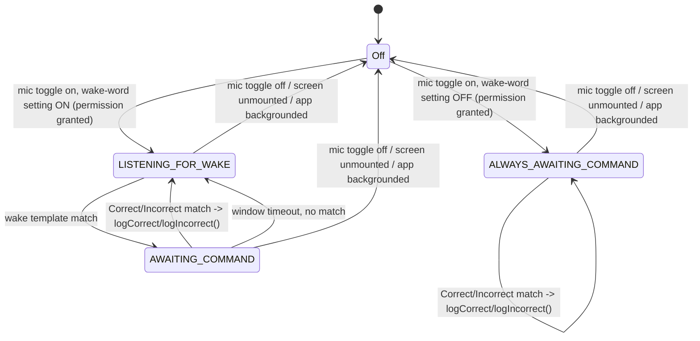
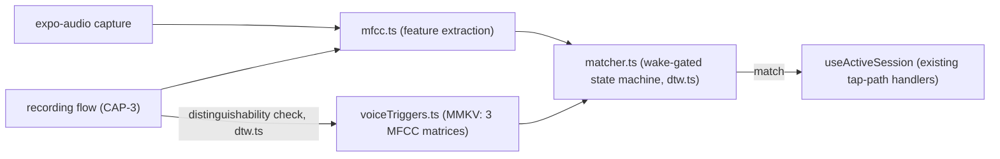

**Amended 2026-09-16 (same-day, CAP-4 added to spec):** AD-2 gains a second matcher mode (wake-word off) and a new AD-7 pins where the wake-word setting and the 2-second recording cap live. **Amended again same-day (UX decision):** the wake-word toggle is a live switch on the Active Session screen itself, not Settings-only, and takes effect immediately mid-listening — AD-2 and AD-7 updated accordingly. AD ids 1/3/4/5/6 unchanged; see each amended AD's own note.

# Architecture Spine — Voice-command Correct/Incorrect input

## Design Paradigm

**A wake-gated two-state matcher, not a continuous classifier.** The matcher is either `LISTENING_FOR_WAKE` (only the wake template is checked against each live audio window) or `AWAITING_COMMAND` (only the Correct/Incorrect templates are checked, for a bounded window, then reverts to `LISTENING_FOR_WAKE` on timeout). It never checks Correct/Incorrect templates while in the wake state — this is what bounds false positives from ambient instrument/room noise (SPEC constraint), not the matching threshold alone.

**The matcher drives the existing mechanic layer; it does not replace it.** A wake→command match calls the same `logCorrect`/`logIncorrect` functions `useActiveSession`'s tap handlers call — there is exactly one session-state write path, tap or voice. This is what makes the SPEC's success signal ("voice-only session counters match tap-only") true by construction rather than by parallel-implementation discipline.



**CAP-4, wake-word toggle:** the Active Session screen carries a live switch for `wakeWordEnabled`, alongside the mic on/off toggle — flipping it while `listening` is true switches the matcher's active state graph immediately, not just the persisted setting. `ALWAYS_AWAITING_COMMAND` never checks the wake template and never times out — it is not `AWAITING_COMMAND` with an infinite window, it is a structurally separate state that only ever checks Correct/Incorrect templates.



## Invariants & Rules

### AD-1 — Matcher output calls the existing tap-path transitions directly

- **Binds:** `src/lib/voiceCommand/matcher.ts` → `useActiveSession`'s existing `logCorrect`/`logIncorrect`.
- **Prevents:** a second session-state mutation path that could drift from the tap path's MMKV write strategy, streak/target derivation, or completion transition; two builders independently guessing how a plain module reaches a hook's handlers and producing incompatible module shapes.
- **Rule:** the matcher holds no session-state logic of its own. `matcher.ts` is a plain factory function, `createMatcher({ onCorrect, onIncorrect }) -> Matcher`, with no import of and no reach into `useActiveSession` itself — it is framework-agnostic and callback-driven. `useVoiceCommand` (the hook, which *does* call `useActiveSession`) is the only place a `Matcher` is constructed, passing `useActiveSession`'s `logCorrect`/`logIncorrect` function references as `onCorrect`/`onIncorrect` directly — not wrapped, not reimplemented. On a Correct/Incorrect match in `AWAITING_COMMAND`, the matcher calls the corresponding callback exactly once. Session-state architecture (synchronous MMKV writes, derive-on-read `target_streak`, single completion rule) is unchanged and fully inherited from the base architecture.

### AD-2 — Wake-gated two-state matcher bounds false positives; a wake-word-off mode trades that protection away explicitly [amended 2026-09-16, CAP-4]

- **Binds:** `src/lib/voiceCommand/matcher.ts`.
- **Prevents:** an ungated matcher firing Correct/Incorrect from ambient noise resembling those templates in isolation (explicit SPEC constraint), in the default mode; two builders disagreeing on whether "wake-word off" reuses `AWAITING_COMMAND` (with its timeout/reversion semantics) or is a genuinely different state.
- **Rule:** `createMatcher()` exposes `setWakeWordEnabled(boolean)`, called both at construction and on every live flip of the Active Session screen's wake-word switch (see the CAP-4 note above the diagram) — the matcher reacts immediately, it does not wait for the next mic toggle-on. When `true`: exactly the two states `LISTENING_FOR_WAKE` and `AWAITING_COMMAND` as diagrammed — `AWAITING_COMMAND` only exists for a bounded window after a wake match, timing out silently back to `LISTENING_FOR_WAKE` with no action taken. When `false`: a single state, `ALWAYS_AWAITING_COMMAND` — the wake template is never loaded or checked, there is no window and no timeout, and every live audio window is checked directly against the Correct/Incorrect templates for as long as `listening` stays true. **Transition on a live flip:** switching `false → true` while listening always lands in `LISTENING_FOR_WAKE` (never mid-flight into `AWAITING_COMMAND`) — a user who just enabled the wake requirement must produce a wake trigger before a command counts, even if they were mid-utterance. Switching `true → false` from either `LISTENING_FOR_WAKE` or `AWAITING_COMMAND` lands in `ALWAYS_AWAITING_COMMAND` immediately, discarding any in-progress wake-match window. Window/threshold tuning constants remain deferred (see Deferred), unaffected by which mode is active.

### AD-3 — MFCC extraction and DTW distance are hand-rolled, not a dependency

- **Binds:** `src/lib/voiceCommand/mfcc.ts`, `src/lib/voiceCommand/dtw.ts`.
- **Prevents:** a dependency-governance approval (parent CLAUDE.md §5.2) for a one-off, well-bounded algorithm over three short templates; adopting `meyda` (Web Audio API–targeted, not a React Native fit).
- **Rule:** `mfcc.ts` (FFT → mel filterbank → cepstral coefficients) and `dtw.ts` (DTW distance matrix between two MFCC sequences) are pure TypeScript, no native module, no new npm dependency. `dtw.ts` is the single distance function used both by live matching (AD-1/AD-2) and by CAP-3's save-time distinguishability check (AD-6) — never two divergent similarity metrics.

### AD-4 — Audio capture via expo-audio, foreground-and-mounted only; the hook's boolean is the single source of truth for toggle state

- **Binds:** `src/lib/voiceCommand/recorder.ts` (live listening windows and template recording), the `useVoiceCommand` hook's mount/unmount and `AppState` handling, the Active Session screen's mic toggle UI.
- **Prevents:** shipping a known-deprecated, Expo-Go-unsupported audio API (`expo-av`'s Audio, removed from Expo Go as of SDK 55 — not merely discouraged); background-audio entitlement/foreground-service complexity for a feature that is inherently a foreground, hands-busy-at-the-instrument activity; the on-screen toggle showing "on" while capture has silently stopped, or vice versa.
- **Rule:** `expo-audio` (pinned `57.0.5`, current as of 2026-09-16 — see Stack; requires the same dev client as `react-native-mmkv`, unsupported in Expo Go) is the sole audio-capture dependency, used both for template recording (CAP-3) and live listening windows (CAP-1). `useVoiceCommand` owns exactly one boolean, `listening`, which is both the toggle's displayed value and the matcher/recorder's actual run state — there is no second, screen-owned copy of this state; the toggle UI renders `listening` directly and calls the hook's `toggle()` to change it. Capture runs only while the Active Session screen is mounted **and** `listening` is true. Unmounting the screen, navigating away, or the app leaving foreground (`AppState` transition to `background`/`inactive`) stops capture immediately **and sets `listening` to false** (not merely "pauses" it) — so the toggle visibly reverts to off on next render, and foreground return never auto-resumes listening; the user must re-tap. No background listening capability is added anywhere in this scope.

### AD-5 — Mic permission requested lazily, once, on first toggle-on; every subsequent tap re-runs the same check, never a different path

- **Binds:** the mic toggle's `onPress` handler.
- **Prevents:** a microphone permission prompt at install/onboarding/app launch — this app's first-ever OS permission request must appear only when the user actually asks for the capability (PRD NFR8/9 addendum, SPEC constraint); two builders diverging on whether a post-denial tap disables the toggle outright vs. re-prompts indefinitely.
- **Rule:** every `onPress` of the toggle — first tap or the hundredth — runs the identical sequence: call `expo-audio`'s permission-request API, then branch on its result. There is no separate "already denied" code path and the toggle is never disabled/hidden after a denial. On the platform's OS-enforced re-prompt suppression (iOS/Android both refuse to show the native dialog again after a user denial), the call returns the previously-denied status immediately with no dialog; the handler shows the same inline explanation as any denial and leaves `listening` false. This satisfies "no retry loop" through OS behavior, not app-level state — the app itself tracks no denied/blocked flag of its own.

### AD-6 — Trigger templates are stored as MFCC features only, never raw audio

- **Binds:** a new `src/lib/voiceTriggers.ts` storage module (MMKV).
- **Prevents:** an indefinitely-retained raw voice recording persisted to disk; MMKV payload growth from storing audio buffers.
- **Rule:** `voiceTriggers.ts` persists exactly three MFCC feature matrices (wake, Correct, Incorrect) as its own MMKV-backed JSON record — no raw `expo-audio` recording buffer is written to storage at any point; once a template's MFCC matrix is extracted, the raw recording is discarded in memory. Recording a new set (CAP-3) fully overwrites the prior three-template record atomically — no partial-set state is ever persisted. Save runs `dtw.ts`'s distance function pairwise across the three candidate matrices before persisting; any pair below the separation threshold blocks the write and surfaces the rejection to the user (AD-3's single distance function; SPEC CAP-3). **In-progress takes are in-memory-only component state, owned by the recording-flow screen, not `voiceTriggers.ts` or any hook** — the same "app leaves foreground = hard stop" rule as AD-4 applies: backgrounding mid-sequence (e.g. 2 of 3 takes done) discards the in-progress set exactly as it discards a live listening session; there is no cross-launch or cross-background resume of a partial recording. The recording flow is a single uninterrupted foreground session or it starts over.

### AD-7 — Wake-word setting is a persisted preference in `settings.ts`, with a live-writing switch on the Active Session screen; recording cap is a `recorder.ts` constant, not user-configurable [amended 2026-09-16, UX decision]

- **Binds:** `src/lib/settings.ts` (existing v1.1 settings storage module), `src/hooks/useVoiceCommand.ts`, `src/lib/voiceCommand/recorder.ts`, the Active Session screen's wake-word switch.
- **Prevents:** the wake-word setting being treated as ephemeral per-session state (like `listening`) and silently resetting to default every session, when CAP-4 frames it as a standing user preference (noisy vs. quiet practice environment); a builder making the 2-second recording cap configurable when SPEC pins it as fixed; two independent writers of `wakeWordEnabled` (the Active Session switch and a Settings-screen control) drifting if one bypasses `settings.ts`.
- **Rule:** `wakeWordEnabled: boolean` (default `true`) is added to `settings.ts`'s existing persisted-settings record, alongside the overlearning-% — same storage module, same persistence model. It has exactly one write path (`settings.ts`'s own setter) with two UI entry points that both call it: a live switch on the Active Session screen (next to the mic on/off toggle) and, if surfaced in Settings, the same setter — neither owns a separate copy of the value. `useVoiceCommand` subscribes to this value (the same `subscribeToKeys` mechanism the base architecture already uses for reactive MMKV reads) and calls the matcher's `setWakeWordEnabled()` (AD-2) on every change, live, whether the change came from the Active Session switch or Settings. The recording-duration cap (2 seconds, SPEC constraint) is a `recorder.ts` module constant, not a `settings.ts` field — it is not user-configurable in this scope.

## Consistency Conventions

| Concern | Convention |
| --- | --- |
| Naming | Voice-command modules live under `src/lib/voiceCommand/` (`mfcc.ts`, `dtw.ts`, `matcher.ts` exporting `createMatcher()`, `recorder.ts`); trigger storage is `src/lib/voiceTriggers.ts`, separate from session/segment/settings storage modules |
| Data & formats | Trigger templates: MFCC feature matrices only, one three-template record, atomic overwrite (AD-6). No raw audio ever persisted. |
| State & cross-cutting | Exactly one distance function (`dtw.ts`) for both live matching and save-time distinguishability (AD-3, AD-6). Exactly one session-state write path — the matcher is a plain callback-driven module with no hook/session import; `useVoiceCommand` is the sole place it's constructed, wired to `useActiveSession`'s handlers (AD-1). Exactly one `listening` boolean (hook-owned, unpersisted, defaults `false` on every mount — covering CAP-2's "off by default in every new and resumed session" for free, since a resumed session re-mounts the screen) drives both the toggle's displayed value and actual capture state; no screen-owned shadow copy (AD-4). Backgrounding is a hard stop with no resume, for both live listening (AD-4) and in-progress CAP-3 recordings (AD-6). `wakeWordEnabled` is the one persisted (not per-session) piece of voice-command state, living in `settings.ts` alongside the overlearning-%, with one write path and two UI entry points (Active Session live switch, Settings) that both call it — changes apply immediately via subscription, not just on next mic toggle-on (AD-2, AD-7). |

## Stack

| Name | Version |
| --- | --- |
| expo-audio (new dependency) | 57.0.5 — verify current at install time |
| expo | ~57.0.18 (unchanged, inherited) |

## Structural Seed

```text
src/
  lib/
    voiceCommand/
      mfcc.ts        # MFCC feature extraction (AD-3)
      dtw.ts          # DTW distance, shared by matching + distinguishability check (AD-3, AD-6)
      matcher.ts      # wake-gated two-state matcher, or single-state when wake-word off (AD-1, AD-2)
      recorder.ts     # expo-audio capture: live windows + template recording, 2s cap (AD-4, AD-7)
    voiceTriggers.ts   # MMKV storage: 3 MFCC template matrices, atomic overwrite (AD-6)
    settings.ts        # MODIFIED — adds wakeWordEnabled: boolean, default true (AD-7)
  hooks/
    useVoiceCommand.ts # mic toggle state, permission request, mount/AppState lifecycle, subscribes to wakeWordEnabled and reacts live (AD-2, AD-4, AD-5, AD-7)
```

**Deployment & environments:** no change — inherits the base architecture's "no hosting, no server infrastructure" posture; this is client-only capture and matching. Native builds only for this capability's initial scope (see Deferred — web/mic-API parity is not addressed here).

## Capability → Architecture Map

| Capability / Area | Lives in | Governed by |
| --- | --- | --- |
| CAP-1 (voice-logged Correct/Incorrect) | `src/lib/voiceCommand/matcher.ts` → `useActiveSession` | AD-1, AD-2 |
| CAP-2 (mic toggle, off by default) | `src/hooks/useVoiceCommand.ts`, Active Session screen | AD-4, AD-5 |
| CAP-3 (custom trigger recording + distinguishability) | `src/lib/voiceCommand/recorder.ts`, `src/lib/voiceTriggers.ts` | AD-3, AD-6 |
| CAP-4 (wake-word on/off, recording cap) | `src/lib/voiceCommand/matcher.ts` (mode select), `src/lib/settings.ts` (persisted setting), `src/lib/voiceCommand/recorder.ts` (2s cap constant) | AD-2, AD-7 |
| Audio capture | `src/lib/voiceCommand/recorder.ts` | AD-4 |
| Permission lifecycle | mic toggle `onPress` | AD-5 |

## Deferred

- **Wake/command window timing constants** (AWAITING_COMMAND timeout duration, live-window size/hop for MFCC extraction). Needs empirical tuning against recorded audio fixtures during story implementation — not fixed as an architectural invariant (AD-2).
- **DTW/MFCC distance and separation thresholds** (match threshold, CAP-3 separation threshold). Same reason — empirical, tuned during implementation against real recordings, not asserted here.
- **Web platform parity for this feature.** The base architecture already ships a web build (see the Web Platform Support spine); `expo-audio`'s web support and browser mic-permission UX are not evaluated in this scope. No driver to add it now — voice-command input is native-first.
- **Accessibility / screen-reader interaction** (explicitly out of scope per SPEC-voice-command-input's Non-goals — mic conflicts with TalkBack/VoiceOver's own audio use are unaddressed).
- **Re-recording-for-robustness / multi-sample averaging.** SPEC scope is single-take per trigger; a future robustness pass is not designed here.
