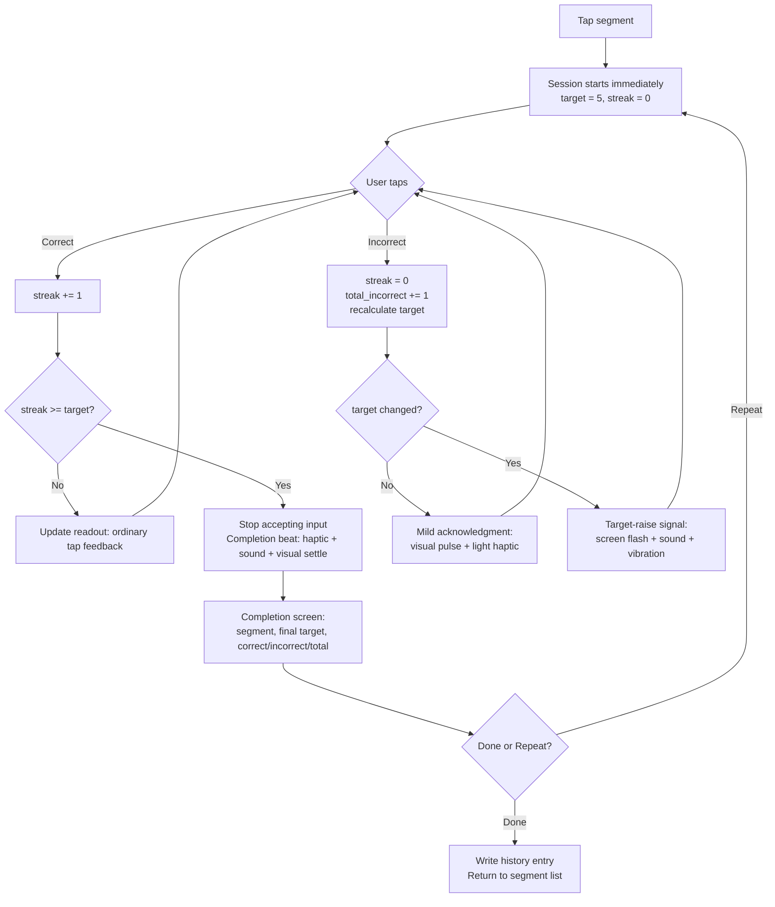
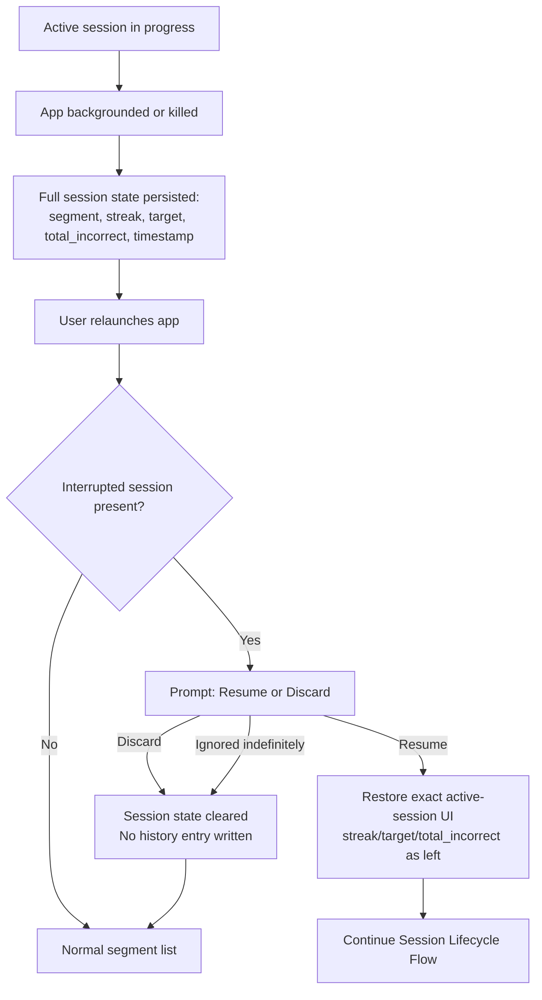

# UX Design Specification Overlearn

**Author:** Gerardo
**Date:** 2026-08-31

---

<!-- UX design content will be appended sequentially through collaborative workflow steps -->

## Executive Summary

### Project Vision

Overlearn is a mobile-first, offline-only app enforcing a live-recalculating, reset-on-miss consecutive-correct-streak mechanic to permanently fix technical practice mistakes for musicians. A session starts immediately at a target of 5 consecutive correct reps; any mistake resets the streak and can raise the target (`max(5, ceil(total_incorrect * 0.5))`). The active session exposes exactly three controls — Correct, Incorrect, confirm-gated Restart — and completes automatically once target is met.

### Target Users

Musicians who already know what they want from practice time — classical guitarists as the beachhead persona (Mara). Not a motivation/gamification audience: they want a rule enforced, not a nudge to practice. Device sits on a stand or table within arm's reach during play, not held. Taps happen in the pause between repetitions, never mid-note — eyes are mostly on sheet music/the instrument, not the screen.

### Key Design Challenges

- **Reach-without-look ergonomics:** controls must be tappable via a quick glance-and-reach from a stand/table — large, edge-anchored, thumb-friendly targets over centered/small ones.
- **Rising-target legibility:** the target can silently climb mid-session (`total_incorrect > 10`); with eyes mostly off-screen, an unsignaled state change risks the user not noticing why the target changed.
- **Restart vs. Correct/Incorrect hierarchy:** Restart is categorically different (confirm-gated, destructive) and must not visually compete with the two no-confirm taps being drilled rapidly.
- **Completion-screen resume gap:** no persisted state exists for "target met, Done/Repeat not yet tapped" — resume behavior if the app is killed there is currently undefined.

### Design Opportunities

- Non-visual/peripheral feedback (haptic pulse, brief color flash) on tap and especially on target-raise, so state changes register without reading text.
- Minimal-chrome active-session screen, resolved as: Correct button anchored top (green, checkmark icon, no text), Incorrect button anchored bottom (red, X icon, no text), streak/target readout (`current/target`, e.g. "4/6") centered between them. Icon-only + color + position gives redundant, glanceable coding without requiring the user to read text.

## Core User Experience

### Defining Experience

The core loop is a single repeated action: tap Correct or Incorrect, without looking, over and over, until the target streak is met. Every other feature (segments, history, interruption recovery) exists to support this one loop. If this tap isn't instant, unambiguous, and reliably capturable without visual confirmation, the product fails at its core value.

### Platform Strategy

Mobile app, iOS and Android, touch-only, fully offline (per PRD Mobile App Specific Requirements — no change from PRD). Device is assumed on a stand/table, not held, per Executive Summary.

### Effortless Interactions

- Correct/Incorrect tap: zero-thought, redundantly coded (position + color + icon), no confirmation.
- Session start: no setup screen, target computed silently.
- Resume/discard prompt: the one unavoidable extra decision on relaunch, but binary and immediate.

### Critical Success Moments

- **Target-raise mid-session** (`total_incorrect_this_session` crosses the >10 boundary): screen flash + sound + vibration, deliberately forceful since the user's eyes are typically off-screen.
- **Session complete:** a distinct but lower-key beat (haptic pulse + short confirmation sound + visual settle) before transitioning to the completion screen — different from an ordinary tap, but intentionally calmer than the target-raise signal, avoiding gamified celebration.
- **Ordinary Correct/Incorrect tap:** minimal feedback only (readout update, light haptic tick) — must not fatigue the user across dozens of reps per session.

### Experience Principles

1. **One loop, zero ambiguity** — the Correct/Incorrect tap is the product; every design choice defers to keeping it instant and glanceable.
2. **Signal strength matches consequence** — feedback intensity scales with how much the user needs to know without looking (ordinary tap < completion < target-raise).
3. **Friction is reserved for destructive or rare actions** — Restart's confirm gate is the only deliberate speed bump in the entire active-session flow.
4. **No motivation mechanics, even in feedback** — sound/haptic/visual cues confirm state changes; they never celebrate, gamify, or nudge.

## Desired Emotional Response

### Primary Emotional Goals

Calm rigor: the app is a strict, honest referee, not a coach or cheerleader. Users should feel they're trusting a rule, not being motivated. The one deliberate exception is session completion, which is allowed to feel genuinely satisfying and warm — a real payoff for real work — without tipping into gamified celebration (no confetti, no badges, no praise copy).

### Emotional Journey Mapping

- **First open / segment creation:** neutral, functional — get out of the way quickly (no upfront input, per FR8).
- **During the core tap loop:** focused, low-friction, unbothered — the user's attention should stay on their instrument, not the app.
- **On a miss (Incorrect tap):** mild acknowledgment, not neutral-to-the-point-of-invisible and not punitive — a small distinct cue (visual reset + light haptic) that registers as "noted, streak reset," never as guilt or failure.
- **On target-raise (mid-session):** alert, attention-grabbing (flash/sound/vibration per Core Experience) — but purely informational, not judgmental.
- **On session completion:** warm satisfaction — the one moment allowed to feel rewarding, via the distinct completion beat (haptic + sound + visual settle) already defined in Core Experience.
- **Returning to use it again:** confident, habitual — no re-onboarding, no nagging to return.

### Micro-Emotions

- **Confidence over confusion:** redundant coding (position/color/icon) on Correct/Incorrect removes any doubt about which control does what.
- **Trust over skepticism:** the target-raise and completion signals must be honest and consistent every time — never randomized or exaggerated, or trust erodes.
- **Accomplishment over frustration:** the no-undo mistake (Journey 3) is accepted friction — frustration there is by design, not something to soften with a mismatched positive cue.
- **Calm over excitement:** explicitly avoid a dopamine-loop feel around the streak count, despite "streak" being the mechanic's name.

### Design Implications

- Calm rigor → flat, low-chrome visual language; no celebratory animation library, no confetti/particle effects anywhere in the app.
- Mild-acknowledgment-on-miss → the Incorrect tap gets a distinct but restrained cue (e.g., brief color pulse + light haptic tick), clearly different from the neutral Correct tap but well short of the target-raise alert intensity.
- Warm-but-not-gamified completion → the completion beat (already speced: haptic pulse + short sound + visual settle) is the ceiling of positive feedback in the entire app — nothing else should approach or exceed it in intensity.
- Trust through consistency → no variability/randomization in any feedback cue; same trigger always produces the same signal.

### Emotional Design Principles

1. **Calm rigor is the default state** — most of the app, most of the time, should feel unremarkable and quiet.
2. **Completion is the one warm moment** — reserve genuine positive feedback intensity for target-met; nowhere else earns it.
3. **A miss is information, mildly marked, never shamed** — acknowledge it distinctly from a hit, but never with punitive framing.
4. **Consistency builds the trust the product depends on** — every signal must be predictable, or the "proof, not feeling" premise breaks down.

## UX Pattern Analysis & Inspiration

Skipped by user directive — no specific inspiring products were provided. Design decisions in this document proceed from the Core User Experience and Desired Emotional Response sections directly, without external pattern borrowing.

## Design System Foundation

### 1.1 Design System Choice

Hybrid: an established component system for standard screens (segment list, segment creation, history log, resume/discard prompt), and a fully custom-built Active Session screen for the core tap loop.

### Rationale for Selection

- Solo-developer project — an established system minimizes maintenance burden and gives WCAG-AA-compliant defaults (NFR6) for free on every screen that doesn't need bespoke behavior.
- The Active Session screen is the one place the product has genuinely unique requirements (top/bottom icon-only buttons, redundant color/position coding, flash/haptic/sound feedback tiers) — no off-the-shelf component covers this, so it's built custom rather than themed.
- Framework choice (React Native vs. Flutter) remains open per the PRD; this decision is framework-agnostic — React Native Paper (Material) or Flutter's Material/Cupertino widgets both satisfy the "established system for standard screens" role equally.

### Implementation Approach

- Standard screens: platform-default components and layout patterns (lists, forms, dialogs) from whichever framework is chosen at the architecture stage.
- Active Session screen: custom-built, full-bleed layout — Correct button (top), streak/target readout (center), Incorrect button (bottom) — with custom feedback handling for tap/miss/target-raise/completion tiers defined in Core Experience and Desired Emotional Response.
- Resume/discard prompt (FR24): standard system dialog/modal component — it's a simple binary choice, no custom treatment needed.

### Customization Strategy

- Color: green (Correct) / red (Incorrect) locked in by user direction; rest of the palette (background, neutral text, alert-flash color for target-raise) to be defined when visual design tokens are established (later step or architecture stage).
- No icon set has been chosen yet — checkmark/X icons for Correct/Incorrect need a source (platform-native icon font vs. custom SVG), to be resolved during implementation.
- Standard-screen components stay unthemed/default wherever possible, to keep the "no invented UI" footprint minimal per solo-dev maintenance constraints.

## 2. Core User Experience

### 2.1 Defining Experience

*"Tap Correct or Incorrect until the streak holds."* This is what a user would tell a friend — a repetitive, judgment-free tap loop that only ends when the required consecutive-correct count is actually met, with the required count itself climbing if the passage proves harder than assumed.

### 2.2 User Mental Model

Musicians already count reps informally ("let me play that 5 times in a row correctly"). Overlearn's model matches that instinct exactly, just enforced and unforgeable — no self-negotiating "close enough" the way an unaided tally does. No education needed; it's a formalization of something they already do in their head.

### 2.3 Success Criteria

- User never has to think about *how* to log a rep — tap position is muscle memory within one session.
- User always knows current progress via the `current/target` readout (e.g., "4/6") without needing to interpret anything.
- A miss never requires a decision — it's an instant, deterministic reset (FR18), no dialog, no "are you sure."
- Completion is unambiguous and automatic (FR12) — the user never has to declare "I'm done," the system decides.

### 2.4 Novel UX Patterns

Established interaction pattern (two-button tap-to-log, familiar from tally counters/scorekeeping apps), applied to a genuinely novel mechanic (live-recalculating target with reset-on-miss). No new interaction vocabulary to teach — the *rule* is new, not the *gesture*.

### 2.5 Experience Mechanics

1. **Initiation:** User taps a segment, session begins immediately at target 5 — no setup screen (FR8, FR9).
2. **Interaction:** User taps Correct (top, green, checkmark) or Incorrect (bottom, red, X) after each attempt. `current/target` readout updates instantly (<100ms, NFR1).
3. **Feedback:**
   - Correct: readout increments, minimal/light feedback (ordinary tap tier).
   - Incorrect: streak resets to 0, mild distinct acknowledgment (visual pulse + light haptic), total-mistakes ticks up, target silently recalculates.
   - **Target-raise** (when recalculation actually changes the number, i.e., `total_incorrect_this_session` crosses past 10): screen flash + sound + vibration — the readout's denominator visibly changes (e.g., "0/5" → "0/6"), and this forceful multi-channel signal is what makes that change legible without reading the screen.
   - Restart: confirm dialog first ("Restart session? Progress will be lost."), then all four fields reset and the screen returns to "0/5" as if session just started.
4. **Completion:** The moment `current_streak >= target_streak`, input stops accepting taps (FR22), the completion beat fires (haptic + sound + visual settle), and the screen transitions to the Completion summary (segment name, final target, total correct + incorrect, total attempts) with Done/Repeat actions (FR13–FR15).

**Restart placement/hierarchy:** Restart sits below the Incorrect button, visually smaller and lower-contrast than the two primary buttons — it reads as a subordinate utility action, not a third peer control, and its confirm-gate is the only friction point in the entire active-session flow.

**Completion-screen resume state:** the completion screen is not a modal overlay on top of the active session — it *is* the next screen state. If the app is killed while it's showing, on relaunch the persisted session state should already reflect `session_complete = true` (a field the Mechanic Specification already defines), so the app can restore directly to the completion screen rather than the resume/discard prompt. Architecture note: `session_complete` must be persisted synchronously as part of the same write that sets the final streak, not as an afterthought.

## Visual Design Foundation

### Color System

- **Background:** near-black neutral (`#121212`-range dark surface) as the default — a dark, quiet canvas reads as calm/focused rather than energetic, and reduces glare/eye strain when the device sits on a stand at arm's length in a dim practice room. Light mode as a secondary/system-following option, not the primary design target.
- **Correct:** green (locked by user direction) — semantic "go/pass," used only for the Correct button and its brief tap feedback.
- **Incorrect:** red (locked by user direction) — semantic "stop/reset," used only for the Incorrect button and its mild acknowledgment pulse.
- **Target-raise alert:** a third, distinct accent (proposed: amber/yellow) reserved exclusively for the screen-flash on target-raise — must not overlap visually with either Correct-green or Incorrect-red, so the three signals stay unambiguous from each other.
- **Neutral text/UI:** desaturated gray scale for the streak/target readout, segment names, history log — deliberately unremarkable, consistent with "calm rigor is the default state."
- **Restart control:** low-contrast neutral gray, intentionally recessive relative to the green/red buttons, reinforcing its subordinate hierarchy.
- **Accessibility:** all color pairings meet WCAG AA contrast (NFR7 requires no reliance on color alone — Correct/Incorrect are already redundantly coded by position + icon shape, so color is reinforcement, not the sole signal).

### Typography System

- **Tone:** plain, functional, non-decorative — no display/brand typeface, system default (San Francisco / Roboto) is sufficient and keeps the "referee, not coach" feel.
- **Type scale:** large numeral display for the `current/target` readout (the single most-read piece of text in the app, must be legible at a glance from arm's length); standard body/label sizes elsewhere (segment names, history rows, dialog text).
- **Content volume:** minimal throughout — no long-form text anywhere in the app; this keeps typography secondary to color/icon/position as the primary communication channels.
- **Accessibility:** support OS-level dynamic type/font scaling; large-numeral readout must remain legible even at larger accessibility text sizes.

### Spacing & Layout Foundation

- **Base unit:** 8px grid, standard for both Material and Cupertino conventions — keeps the standard-screen components (per Design System Foundation) unthemed and consistent with platform defaults.
- **Active Session screen:** airy, full-bleed — Correct button occupies the top ~40% of the screen, Incorrect the bottom ~40%, streak/target readout centered in the remaining ~20%. Large touch targets (well above the 44×44pt NFR6 minimum) intentionally oversized for reach-without-look tapping, not just compliance.
- **Standard screens:** conventional list/form density from the chosen platform's default components — no custom spacing system needed there.

### Accessibility Considerations

- NFR6 (44×44pt minimum touch targets): Active Session buttons vastly exceed this by design; standard-screen components inherit it from the established system.
- NFR7 (no color-alone distinction): Correct/Incorrect already redundant via position + icon; target-raise alert is redundant via flash + sound + vibration, not color alone.
- Dark-mode-primary design must still pass contrast checks against light-mode/system-following fallback, not just the primary dark theme.

## Design Direction Decision

### Design Directions Explored

Given how much of the Active Session screen was already locked by prior steps (button positions, colors, dark background, layout proportions), a divergent multi-direction exploration wasn't appropriate. Instead, a single focused HTML mockup of the Active Session screen was built at `_bmad-output/planning-artifacts/ux-design-directions.html`, implementing the locked layout with interactive previews of the four feedback states: ordinary tap, incorrect mild pulse, target-raise flash, and session completion.

### Chosen Direction

Confirmed as-is: Correct button top (green, checkmark, no text) occupying ~40% of screen height; Incorrect button bottom (red, X, no text) occupying ~40%; centered readout zone (~20%) showing `current/target` (e.g., "4/6") and the segment name; Restart as a small, low-contrast pill anchored to the bottom edge, visually subordinate to the two primary buttons. Dark near-black background throughout.

### Design Rationale

Matches every constraint established in Core User Experience, Desired Emotional Response, and Visual Design Foundation: redundant coding (position + color + icon) for zero-thought tapping, restrained/recessive Restart to preserve its subordinate hierarchy, and a completion screen that reads as a genuine but non-gamified state change (single checkmark icon, plain stats, Done/Repeat actions) rather than celebratory UI.

### Implementation Approach

The HTML mockup's structure (button sizing ratios, color values, animation timing for pulse/flash) can be used directly as a reference during implementation of the Active Session screen described in Design System Foundation. No further visual exploration needed before moving to detailed screen-by-screen flows.

## User Journey Flows

### Session Lifecycle Flow (Journeys 1 & 3 — Happy Path + No-Undo Mistake)



No undo affordance exists on the Correct/Incorrect tap itself (FR19) — an accidental Incorrect tap (Journey 3) follows the same `K` branch as a genuine miss; there is no alternate recovery path, by design.

### Interruption & Resume Flow (Journey 2)



Per NFR4, the app must never silently resume or silently discard — step `E→G` is mandatory whenever an interrupted session is still incomplete, with no timeout-based auto-decision. **(Amended 2026-09-12, code review of Story 5.2 round 2):** from v1.1, the Settings-driven completion transition (FR37) can complete an interrupted session before this check runs (step `E`'s own read of `session_complete` sees `true`), routing to the Completion screen instead of `E→G` — that is a completion, not a silent resume or discard, so NFR4 is unaffected.

### Restart Flow (Journey 4)

```mermaid
flowchart TD
    A[Active session in progress] --> B[User taps Restart<br/>small, low-contrast, bottom-anchored]
    B --> C[Confirm dialog:<br/>"Restart session? Progress will be lost."]
    C -->|Cancel| A
    C -->|Confirm| D[All four fields reset:<br/>streak=0, total_incorrect=0, target=5, start_timestamp=now]
    D --> E[Screen returns to fresh session state: 0/5]
    E --> A
    C -.->|No history entry written, no partial record| F[N/A — nothing persisted from the discarded attempt]
```

### Journey Patterns

- **Two-tier confirmation model:** Correct/Incorrect never confirm (FR19 constraint drives zero friction); Restart always confirms (FR21) — the confirm gate is reserved exclusively for state-destroying actions.
- **State-first persistence:** every transition in the Session Lifecycle and Restart flows writes to persisted state before/alongside the UI update, so the Interruption flow can always recover an exact snapshot rather than an approximation.
- **History-write is terminal-only:** across all three flows, the *only* path that writes a history entry is `Done` after a genuine completion (`I -->|Done|` in the Session Lifecycle flow). Discard, Restart, and app-kill-without-resume all bypass history entirely — this is consistent, not an edge case per flow.

### Flow Optimization Principles

- **Minimize steps to the core loop:** zero steps between tapping a segment and being able to log the first repetition (no setup screen).
- **Reduce cognitive load at the one unavoidable decision:** the resume/discard prompt is binary, immediate, and un-skippable — no secondary options to weigh.
- **Feedback intensity signals flow position:** ordinary tap (quietest) → miss (mild) → target-raise (loud) → completion (distinct-but-calm) — the flows above show these are the only four feedback tiers in the entire app, keeping the vocabulary small and learnable.
- **Error recovery is asymmetric by design:** Correct/Incorrect taps have zero recovery path (accepted friction, per Journey 3); Restart is the recovery mechanism for an entire bad session, not for a single mistaken tap.

## Component Strategy

### Design System Components

From the established system (React Native Paper / Flutter Material-Cupertino, per Design System Foundation), used unthemed wherever possible:

- List component (segment list)
- Text input / form fields (segment creation/rename)
- Standard dialog/modal (resume vs. discard prompt, Restart confirm)
- Basic navigation (segment list ↔ segment history ↔ active session)
- Swipe-actions or menu (delete on a segment row)
- Simple list/table rows (history log entries)

### Custom Components

#### Active Session Control Pair (Correct / Incorrect buttons)

**Purpose:** The core repeated-tap interaction — log a repetition as correct or incorrect.
**Content:** No text; a single icon each (checkmark, X).
**Actions:** Single tap, no long-press/secondary actions.
**States:** default, brief tap-feedback (color pulse per Correct — minimal; per Incorrect — mild pulse), disabled (once session completes, per FR22).
**Variants:** None — fixed size/position across all sessions (top ~40% / bottom ~40% of screen).
**Accessibility:** Large touch target well above 44×44pt minimum (NFR6); accessible label "Correct" / "Incorrect" for screen readers, since the button itself carries no text.

#### Streak/Target Readout

**Purpose:** Shows live progress (`current/target`, e.g. "4/6") and segment name.
**Content:** Two numerals + separator + segment name label.
**Actions:** None — display-only, no tap target.
**States:** default, target-raise flash (screen-wide, triggers when the denominator changes), settle state on completion.
**Variants:** None.
**Accessibility:** Large numeral text scales with OS dynamic type; screen-reader announcement on target change (not just visual flash) so the signal reaches non-visual users too.

#### Restart Control

**Purpose:** Full in-progress-session reset, confirm-gated.
**Content:** "Restart" label (this is the one active-session control that does use text, since it's a lower-frequency, higher-stakes action where a label reduces misclicks).
**Actions:** Tap → opens confirm dialog (standard design-system dialog, not custom).
**States:** default (low-contrast/recessive), pressed.
**Variants:** None.
**Accessibility:** Meets 44×44pt minimum despite its visually smaller footprint (padding compensates for the minimum touch target).

#### Feedback Signal System (cross-cutting, not a visual component)

**Purpose:** Coordinates the four feedback tiers (ordinary tap, incorrect pulse, target-raise flash, completion beat) across visual (color/flash), haptic, and audio channels consistently.
**States:** the four tiers defined in Core User Experience and Desired Emotional Response — this is implemented as shared logic, not a UI widget, but is specified here because every custom component above depends on it firing consistently.

### Component Implementation Strategy

- Build the four custom components/behaviors above using the design tokens from Visual Design Foundation (colors, spacing, type scale) so they stay visually coherent with the design-system-driven standard screens.
- Standard screens receive zero custom component work — the entire component-design effort concentrates on the Active Session screen, consistent with the hybrid Design System Foundation decision.
- Feedback Signal System is implemented once, centrally, and invoked from all four tap/state-change points — avoids drift between "what the mockup shows" and "what actually fires" per interaction.

### Implementation Roadmap

**Phase 1 — Core Components (blocking for MVP):**
- Correct/Incorrect button pair
- Streak/Target readout
- Feedback Signal System (all four tiers)

**Phase 2 — Supporting Components (needed for MVP but lower risk):**
- Restart control + confirm dialog
- Resume/discard prompt (standard dialog)
- Completion screen (standard layout + custom completion beat trigger)

**Phase 3 — Standard CRUD (lowest risk, design-system-only):**
- Segment list, creation form, delete action
- History log list

## UX Consistency Patterns

### Button Hierarchy

- **Primary (session-critical):** Correct, Incorrect — full-size, color-coded, icon-only, always visible during an active session, no confirmation.
- **Secondary/utility (destructive, gated):** Restart — small, low-contrast, text-labeled, always confirm-gated.
- **Standard actions (design-system default):** Done, Repeat, Resume, Discard, segment CRUD actions — use platform-default button styling; primary action (e.g., Repeat, Resume) visually emphasized over secondary (Done, Discard) per platform convention, no custom treatment needed.

### Feedback Patterns

Four tiers only, applied consistently everywhere they occur (defined in Core User Experience, Desired Emotional Response, Component Strategy):

| Tier | Trigger | Signal |
|---|---|---|
| Ordinary | Correct tap | Minimal — readout increments, light haptic tick |
| Mild | Incorrect tap (no target change) | Visual pulse + light haptic |
| Alert | Incorrect tap causing target-raise | Screen flash + sound + vibration |
| Distinct | Session completion | Haptic pulse + short sound + visual settle |

No fifth tier is introduced anywhere else in the app (e.g., segment creation, delete) — those use plain design-system default feedback (e.g., a standard toast/snackbar or instant list update), since they carry no gameplay weight.

### Form Patterns

Only one form exists: segment creation/rename (a single text field, name only). Standard design-system input component, standard inline validation (non-empty name), no multi-step or complex validation logic — consistent with No-Invention Rule (no fields beyond what FR1 requires).

### Navigation Patterns

- **Structure:** flat, three-level — Segment List (home) → Segment Detail (history + Start action) → Active Session / Completion.
- **No tab bar, no drawer, no deep hierarchy** — the app's scope (FR1–FR29) doesn't warrant one; a simple stack/push navigation is sufficient.
- **Active Session is a dead-end screen with one exit** — completion (automatic) or backgrounding (interruption flow); there's no manual "back" out of an active session other than backgrounding, since abandoning mid-session is handled by the interruption/discard flow, not a nav action.

### Additional Patterns

- **Modal/overlay pattern:** used only for the two confirm-style interruptions in the entire app — Restart confirm and Resume/Discard prompt. Both use the standard design-system dialog component; no custom modal styling.
- **Empty state:** segment list with zero segments shows a prompt to create the first one (FR7) — standard empty-state pattern (icon/message + primary CTA), design-system default.
- **Loading states:** not applicable in any meaningful way — the app is fully offline/local, so no network loading states exist anywhere (per NFR8, zero data leaves the device).
- **Search/filtering:** not applicable — no PRD requirement calls for it, and inventing one would violate the No-Invention Rule.

## Responsive Design & Accessibility

### Responsive Strategy

Mobile phones only — no tablet or desktop target (per PRD Mobile App Specific Requirements). "Responsive" here means adapting across the range of phone screen sizes and aspect ratios (small phones to large phones/phablets), not across device classes.

- **Active Session screen:** the top-40%/center-20%/bottom-40% proportional layout scales naturally with any phone screen height — no fixed pixel heights, so it holds up from compact to large phones alike.
- **Standard screens:** inherit responsive behavior from the design system's default components — no custom work needed.
- **Orientation:** portrait-primary, consistent with device-on-a-stand usage (per Executive Summary); landscape support is not a stated requirement and is not designed for in this pass — flagged as an open question for architecture/implementation if it needs explicit locking vs. graceful reflow.

### Breakpoint Strategy

Not applicable in the traditional sense — no tablet/desktop breakpoints exist for this project. The only "breakpoint" consideration is ensuring the Active Session screen's proportional (percentage-based) layout remains legible and touch-target-compliant (NFR6) across the smallest supported phone screen to the largest.

### Accessibility Strategy

**Compliance level:** WCAG 2.1 AA, per NFR6 and NFR7 — already the PRD's explicit bar, not a new decision.

**Key considerations, mapped to this app's actual surface:**
- Touch target size: 44×44pt minimum (NFR6) — Active Session buttons vastly exceed this; standard-screen components inherit it from the design system.
- No color-alone distinction (NFR7): Correct/Incorrect already redundant via position + icon shape + color; target-raise alert redundant via flash + sound + vibration.
- Screen reader support: accessible labels on icon-only buttons (Correct/Incorrect), and the target-raise/completion signals need a screen-reader-audible equivalent (announcement), not just a visual flash — carried over from Component Strategy.
- Dynamic type: streak/target readout and all text must scale with OS font-size settings without breaking layout.
- Color contrast: dark-background palette (Visual Design Foundation) must meet 4.5:1 for normal text against the near-black background.

**Out of scope:** keyboard navigation and desktop screen-reader patterns are not applicable — this is a touch-only mobile app with no keyboard input path except the single segment-name text field.

### Testing Strategy

- **Device testing:** a small range of physical/simulated phone sizes (compact to large), given solo-dev resource constraints — no dedicated device lab.
- **Accessibility testing:** platform-native screen reader (VoiceOver on iOS, TalkBack on Android) pass on the Active Session screen specifically, since it's the one screen with custom, non-standard components; standard screens inherit accessibility from the design system and need lighter verification.
- **Manual verification:** touch-target size and color-contrast checks against NFR6/NFR7 before each release, given no automated a11y pipeline is assumed for a solo-dev offline app.

### Implementation Guidelines

- Use relative/proportional units for the Active Session screen layout (percentage-of-screen-height, not fixed pixels) so it holds across phone sizes.
- Respect OS dynamic type settings for all text; avoid fixed font sizes that block scaling.
- Implement accessible labels (`accessibilityLabel` / `contentDescription`) on all icon-only custom buttons.
- Implement the target-raise and completion audio/haptic/visual signals with a parallel screen-reader announcement path, not purely visual/auditory.
- No landscape-specific layout is required for MVP; simplest approach (lock portrait, or let standard screens reflow naturally) deferred to architecture/implementation decision.

---

# v1.1 Design Additions

**Added 2026-09-06.** Everything above this line specifies **v1.0**, shipped and frozen at git tag `v1.0.0`. This section covers the v1.1 scope defined in `prd.md` FR30–FR37: segment rename, duplicate, list sorting, and a Settings screen with a configurable overlearning-%.

## Principles Carried Forward

The v1.0 principles are not renegotiated here. Three constrain every decision below:

1. **The Active Session screen's practice loop is untouched.** No v1.1 feature adds anything to the Correct/Incorrect/Restart loop itself — the one interaction sequence whose design is load-bearing to the product's value. **(Superseded 2026-09-12, FR43):** "Settings is reachable only from Home, never mid-session" is no longer true — manual UAT of UAT-38/39/40/41 found this left FR37/FR39 untestable and unreachable in the shipped build. The screen now carries a gear icon (see "Settings Entry Point on Every Screen (FR43)" below); the practice loop itself gains no new control.
2. **Calm rigor, minimal chrome.** New controls are subordinate to the segment list, not competing with it.
3. **No fifth feedback tier.** Rename, duplicate, and sort are non-gameplay actions and use plain design-system feedback (instant list update, standard snackbar), exactly as segment creation and delete already do.

## Navigation Update

The v1.0 navigation model — *"flat, three-level: Segment List → Segment Detail → Active Session. No tab bar, no drawer"* — gains one screen and one modal route:

```
Segment List (home) ──┬─→ Segment Detail ──→ Active Session / Completion
                      ├─→ Segment Rename (modal-style push, from row menu)
                      └─→ Settings (push, from header gear icon)
```

Still no tab bar and no drawer. Settings and Rename are both leaf screens with a single back exit. The three-level practice path is unchanged in depth and shape.

**(Superseded 2026-09-12, FR43):** the diagram above under-states reachability — Settings is now pushed from a gear icon present on **every** screen (Home, Segment Detail, Active Session, Completion), not only Home's header:

```
Segment List (home) ──┬─→ Segment Detail ─┬─→ Active Session / Completion
     │                 ├─→ Segment Rename  │        │
     │                 └─→ Settings ◄──────┴────────┘
     └─→ Settings ◄── (also reachable directly from Home)
```

Settings remains a leaf screen with a single back exit from every entry point. Navigating to it from Active Session/Completion does not end, reset, or otherwise mutate the session underneath — the practice screen is simply covered by the push and restored on back, per FR43.

## New Screen: Settings

**Entry point:** a gear icon, right-aligned in a fixed corner. **(Superseded 2026-09-12, FR43):** originally Home-only; now present on every screen — see "Settings Entry Point on Every Screen (FR43)" below for the Active Session/Completion treatment specifically.

**Content — one setting, nothing else.** FR35–FR37 specify only the overlearning-%; per the No-Invention Rule, no other settings, no account section, no about/version block unless later specified.

**Layout, top to bottom:**

1. **Label** — "Overlearning target" (standard body/label type).
2. **Stepper row** — `[ − ]  150%  [ + ]`. The value uses the large-numeral type scale borrowed from the streak readout, since it is the screen's single subject. Minus left, plus right, value centered between them.
3. **Live worked example** — one line, recomputing on every step, in the desaturated neutral text color:
   > *At 150%, 10 mistakes in a session sets a target of 15 correct in a row.*

   The example uses a fixed illustrative mistake count (10) so only the outcome changes as the user steps, keeping the sentence stable enough to re-read at a glance. This exists because the setting is otherwise abstract: the percentage applies to mistakes made, a quantity that is not on screen at the moment of choosing.
4. **Floor note** — one line, small, neutral: *"A session never targets fewer than 5 correct in a row."* States the fixed `TARGET_FLOOR` so a user setting 50% understands why low mistake counts still demand 5.
5. **In-progress-session notice (FR39)** — shown above the stepper, only when an in-progress session exists for any segment: a low-contrast neutral banner, same visual register as the floor note rather than an alert color, reading:
   > *"You have a session in progress for 'Bar 24 arpeggio.' Changing this target updates it immediately — and may complete the session."*
   >
   > (Corrected 2026-09-11, code review of Story 5.2: the original wording described only a recalculation, not the completion Story 5.2's Task 3 reconciliation effect can also trigger from a single tap, with no confirmation gate to carry that warning per-tap instead.)

   **Standing notice, not a confirmation gate.** It is present the whole time Settings is open with an active session elsewhere — it does not interrupt the stepper, does not require dismissal, and does not repeat per tap. Ten taps in a row show the same one line the whole time, not ten dialogs. This follows the app's existing rule that friction is reserved for destructive, hard-to-reverse actions (Restart, Delete). **(Corrected 2026-09-12, code review of Story 5.2 round 2):** the "changing a target is neither [destructive nor hard-to-reverse]; the user can step back to the previous value just as easily" reasoning above no longer holds without qualification — see the correction at "No confirmation on change" below. Absent when no session is in progress: the row simply isn't rendered, rather than showing an empty or negated state.

**Stepper behavior:**

| State | Treatment |
|---|---|
| Default | Both buttons active; each tap moves the value by 10 percentage points |
| At 50% (minimum) | `−` **disabled** — visibly recessive, `accessibilityState: { disabled: true }` |
| At 300% (maximum) | `+` **disabled**, same treatment |
| On change | Value updates immediately and persists immediately; no Save button, no confirmation |

Disabled-at-bounds is chosen over a silent no-op so the range is discoverable by feel — a button that does nothing when tapped reads as a bug, not a limit.

**No confirmation on change.** Consistent with the app's existing posture: confirmation is reserved for destructive actions (Restart, Delete). **(Corrected 2026-09-12, code review of Story 5.2 round 2):** this previously read "Changing a target is reversible by stepping back," which is false with an in-progress session present — if the change completes the session (FR37's Settings-driven completion transition), FR22's lockout takes effect immediately and irreversibly; stepping the value back afterward does not undo the completion. The step-back-is-easy reasoning holds only when no in-progress session exists, or when the change does not cross into completion.

**Mid-session change.** FR37 requires an in-progress session's target to recalculate immediately, and can complete the session outright (see the Mechanic Specification's Settings-driven completion transition). A UI **is** specified for this on the Settings screen: the standing in-progress-session notice (FR39, see item 5 in "Layout, top to bottom" above), which warns of both consequences before the user changes the value. (Corrected 2026-09-11, Story 5.3's implementation: this paragraph previously read "No UI is specified for this on the Settings screen" and "Deliberately not designed: a warning or confirmation" — true when first written (2026-09-06, before FR39 existed), but left uncorrected when FR39 and the notice were added later the same day, and again when Story 5.2's code review amended the completion consequence. `_bmad-output/implementation-artifacts/5-2-...md` cited the old wording as authority for adding no UI; that citation is now stale too.)

## Settings Entry Point on Every Screen (FR43, added 2026-09-12)

**Root cause:** manual UAT of UAT-38 through UAT-41 (2026-09-12) found the Active Session screen had no navigation control at all — no way to reach Settings, or even Home, while a session was in progress or interrupted. FR37 (live target recalculation) and FR39 (in-progress-session notice) both assume Settings is reachable mid-session; nothing in this document specified how, because the original v1.1 extension's Principle 1 explicitly assumed the opposite ("Settings is reachable only from Home, never mid-session").

**Design:** a small gear icon, fixed top corner, 44×44 minimum tap target, added to:
- Active Session screen (both the in-progress state and the Completion state)
- Segment Detail screen

Home already carries the gear icon (unchanged). This is the same icon, same placement convention, same `accessibilityLabel="Settings"` treatment as the existing Home instance — not a new visual pattern, just a new set of screens that carry it.

**Behavior:** tapping it pushes Settings on top of the current screen, exactly as it does from Home. Returning (back) restores the underlying screen exactly as left — an in-progress or interrupted session is not ended, reset, completed, or otherwise mutated by the navigation itself. (A session **can** still complete as a side effect of a value the user changes once inside Settings — that is FR37's existing, correctly-specified behavior, unrelated to the navigation gap FR43 closes.)

**Why a corner icon, not a header bar with back+gear:** the Active Session screen has no header today and none of the v1.0 principles call for adding one — a single small icon is the minimum change that satisfies FR43 without adding chrome that competes with Correct/Incorrect for thumb reach or visual priority. Decided with the user 2026-09-12, choosing this over a full header-bar-with-back-button alternative.

**Component:** default pressable + icon, no new custom component — same budget statement as the rest of v1.1 (see Component Strategy Additions below).

## Segment List Additions

### Sort Control

**Placement:** a single pressable row directly above the segment list, below the header. Label format: **`Sort: Last practiced ▾`** — the active sort is always visible without opening anything.

**Interaction:** tapping opens the standard Modal-menu component already used for segment row actions (`SegmentListItem`'s menu) — same backdrop, same dismiss behavior, same 44×44 row targets. No new modal pattern is introduced.

**Menu contents:** four options, with the active one marked and carrying its current direction:

| Option | Default direction on first selection |
|---|---|
| Name | A→Z |
| Date created | Newest first |
| Last practiced | Most recent first |
| Solidification % | Highest first |

**Direction toggle:** tapping the **already-active** option flips its direction; tapping a different option selects it at that option's default direction.

**(Superseded 2026-09-12, FR42):** the paragraph above ("keeps direction control inside the existing menu rather than adding a second control") is no longer the whole picture. Manual UAT of UAT-35 found that flipping direction by re-selecting the active menu option is a non-obvious, undiscoverable gesture. FR42 adds a dedicated `↑`/`↓` icon button immediately to the right of the `Sort: X ▾` trigger, same row, same 44×44 minimum target. Tapping it flips direction in place and re-sorts the list live — same effect as the menu's re-tap-active-option path, which is kept, not removed (both remain valid ways to flip direction). The icon shows the *current* direction (↑ ascending, ↓ descending), not an action glyph, matching the stepper's disabled-at-bounds philosophy of showing state rather than requiring a tap to discover it.

**Persistence (FR34):** the selected option and direction are restored on next launch. The list therefore never reorders unexpectedly between sessions.

**Empty and single-segment states:** the sort control is hidden when zero segments exist (the v1.0 empty state per FR7/UX-DR11 is unchanged) and when exactly one exists, where sorting is meaningless.

**Supersedes:** the v1.0 statement under *UX Consistency Patterns → Additional Patterns* — *"Search/filtering: not applicable — no PRD requirement calls for it, and inventing one would violate the No-Invention Rule."* That remains true for **search and filtering**, which FR33 does not introduce. FR33 introduces **ordering only** — no query input, no subset of segments is ever hidden.

### Row Summary Data (FR41, added 2026-09-12)

Each row gains a second and third line below the segment name — the row grows from one line to three:

```
Bar 24 arpeggio
Last practice: 10 Sep 2026 · 42.3%
Created 02 Sep 2026
```

- **Line 2:** `Last practice: {dd Mmm yyyy} · {Solidification %}`, one decimal place. A segment never practiced reads `Last practice: — · —` — same em-dash convention as FR38's history-log summary, for the same reason (avoids "0.0%" misreading as "scored zero"). **(Specified 2026-09-12, Story 4.6's code review):** a true value strictly between 0 and 100 is clamped to `[0.1%, 99.9%]` — `"100.0%"`/`"0.0%"` are reserved for the true mathematical boundary only, so a rounding artifact at, say, 99.97% never misreads as "fully solidified." This mirrors FR38's whole-number reserve-the-boundary rule at one decimal's precision; it shipped as an implementation default before being specified here.
- **Line 3:** `Created {dd Mmm yyyy}`, always populated — every segment has a creation date from FR1.
- **Type treatment:** lines 2–3 use the small/secondary label type already used for the sort menu's non-selected items — supporting data, not competing with the name for visual weight.
- **No new interaction.** Static text, not tappable independent of the row itself; a normal tap still opens Segment Detail (unchanged from FR40/UAT-37's step 5).
- **Row height:** three lines when static. **(Corrected 2026-09-12, Story 4.6's code review):** the original wording here claimed "no truncation or ellipsis... all three lines fit without wrapping" — the shipped implementation applies `numberOfLines={1}` to lines 2–3 (matching the name line), so a summary line exceeding the row's width truncates rather than wrapping. Corrected because a wrapped, taller row was found untested and undesirable at large OS font scales; single-line truncation keeps the row height stable in that case, at the cost of an occasional clipped date/percent on very narrow devices or very large text sizes.
- **Interaction with inline rename (FR40), specified 2026-09-12, Story 4.6's code review:** these two lines remain visible and unchanged while the name is being edited inline (Story 4.5) — only the name line swaps for the `TextInput`. This was left unspecified when FR41 was added and shipped, once, as a collapse (the lines disappeared during editing, shrinking the row and violating FR40's own no-layout-shift requirement); corrected to keep the row's height stable in both states.
- **Accessibility wording, specified 2026-09-12, Story 4.6's code review:** the combined row accessibility label (see Accessibility (v1.1) below) reads a never-practiced segment's fields as "last practice **never**, solidification **no data**" — not a literal "em dash" — since announcing the glyph itself would be meaningless to a screen-reader user. This is deliberately a third convention alongside the visual em dash (FR38) and the sort comparator's 0%-as-floor (FR33): each surface reads correctly for its own audience, and none of the three needs to match the others' internal representation.

### Row Action Menu Additions

The existing `SegmentListItem` menu gains two items. Order, top to bottom:

1. **Rename** (FR30)
2. **Duplicate** (FR32)
3. **Delete** (FR6, unchanged)

Destructive action stays last, separated from the two non-destructive additions. Delete's existing treatment and confirmation behavior are unchanged.

**Duplicate feedback.** The copy appears in the list immediately, but *where* it appears depends on the active sort — under "Name" a copy called "Bar 24 arpeggio (2)" lands adjacent to its original, while under "Solidification %" a copy with no history sorts to the far end and may be off-screen entirely. A silent insertion would therefore read as "nothing happened."

Duplicate confirms with a standard design-system snackbar: *"Duplicated as 'Bar 24 arpeggio (2)'."* This is plain platform feedback, not a fifth feedback tier — it carries no haptic, no sound, and no gameplay weight, matching how the spec already treats segment creation and delete.

## Segment Rename Screen

**Reuses `SegmentForm` unchanged.** The v1.0 Component Strategy already describes this component as *"Text input / form fields (segment creation/rename)"* — the rename case was anticipated in the original design and needs no new component.

- Pre-filled with the segment's current name, cursor at end.
- Submit label: **"Rename"** (vs. "Create" on the creation screen).
- Same inline non-empty validation, same 80-character cap, same disambiguation-on-collision behavior as creation (FR1's collision rule, per FR32).
- On success: return to the segment list, which reflects the new name immediately.

**Name propagation (FR31).** The renamed segment's name must be current in all five display sites the PRD enumerates: segment list row, segment detail heading, active-session streak readout, completion summary, and the resume/discard prompt. No UI design work follows from this — it is a data-sourcing requirement, noted here so the design record matches the FR.

## Inline Rename (FR40)

A second, faster path to the same result as the screen above — both exist; this does not replace it.

**Trigger:** press and hold the segment's name for **1 second**, at exactly two sites: the segment list row and the segment detail heading. Not available at the three read-only name displays (active-session readout, completion summary, resume/discard prompt) — those stay pure display, per FR31.

**Editing state.** On the hold threshold firing, the static text is replaced in place by a `TextInput` pre-filled with the current name, cursor at end, keyboard opening automatically. The row/heading's layout position and size do not shift — the text becomes editable without the surrounding UI moving, so the interaction reads as "this text became a field," not "a new field appeared."

**Commit:** the keyboard's return/submit key (`onSubmitEditing`, per the platform's default "Done"/"Return" action — there is no hardware Enter key on a phone) saves the new name and returns the element to static text. Same validation and disambiguation as FR30/FR32's rename: a name colliding with another segment's is disambiguated, not rejected; an empty name is rejected, and the field's prior value is not lost while the user corrects it.

**Cancel:** tapping outside the field (blur without submitting) reverts to the original name — a half-typed edit is discarded, not silently saved. This mirrors the app's existing "no ambiguous partial state" posture rather than introducing a new discard confirmation for what is a low-stakes, instantly-reversible action.

**Why 1 second, not instant-on-tap:** a plain tap on the list row already navigates (opens Segment Detail); a plain tap on the detail heading has no existing meaning but a *short* threshold would make an ordinary tap-hesitation misfire into edit mode. One second is long enough to be clearly deliberate without requiring an explicit mode-switch icon.

**No new component.** This is a state of the existing text label (list row's name, detail heading), not a new custom component — a `Pressable` wrapping the text, using `onLongPress`/`delayLongPress={1000}`, swapping its rendered child between `<Text>` and `<TextInput>` based on local edit-state.

**Accessibility:** the pressable name carries `accessibilityHint="Press and hold to rename"` in its static state, so the affordance is discoverable without requiring 1 second of trial-and-error from a screen-reader user (VoiceOver/TalkBack both support triggering a long-press action directly). The editing state announces "Editing segment name" on entry.

## Segment History Log Addition: Solidification % Summary

**FR38.** The Segment Detail screen's history log gains one summary line, placed between the segment name heading and the list of entries — above the list, not mixed into it, since it describes the whole segment rather than any single session:

> *Solidification: 78%*

- **Value:** identical computation to FR33's sort key — aggregate correct ÷ aggregate total across every completed session for this segment, not an average of per-session percentages.
- **No history yet:** the line reads *"Solidification: —"* rather than "0%" here specifically (contrast with the sort behavior, which does use 0% to place empty segments consistently) — on the list-sort case 0% is a comparison value the user never reads directly, but on this summary line "0%" would misread as "zero percent correct" rather than "no data yet." Displaying an em dash avoids that misreading.
- **No new interaction.** Static text, not tappable, not the same control as the sort menu — it answers "how is this segment doing," the sort control answers "how do I want the list ordered."
- **Type treatment:** standard body/label type, not the large-numeral scale reserved for the Active Session readout and the Settings stepper — this is supporting information on a detail screen, not the screen's primary subject.

This is deliberately the only place Solidification % is ever shown as a number; the sort menu (FR33) shows it only as a selected criterion, never its value, keeping that control's row-menu treatment unchanged from the design above.

## Component Strategy Additions

Consistent with the v1.0 hybrid strategy — **no new custom components.** All four v1.1 features are built from design-system defaults and components that already exist:

| Element | Source |
|---|---|
| Settings gear icon (header) | Platform default header action |
| Stepper (− / value / +) | Two default pressables + text; no custom component |
| Sort control trigger | Default pressable with text label |
| Sort menu | Existing `SegmentListItem` Modal-menu pattern |
| Rename/Duplicate menu rows | Existing menu-item pattern |
| Rename form | Existing `SegmentForm` |
| Duplicate confirmation | Default snackbar |
| Inline rename (FR40) | `Pressable` + `onLongPress`, swapping `<Text>`/`<TextInput>` in place |
| Settings gear icon on Session/Detail screens (FR43, added 2026-09-12) | Same default pressable + icon as the existing Home instance |
| Sort direction toggle (FR42, added 2026-09-12) | Default pressable + icon, no custom component |
| Row summary data (FR41, added 2026-09-12) | Plain `<Text>` lines, no custom component |

The custom-component budget remains spent entirely on the Active Session screen's practice loop (Correct/Incorrect/Restart), exactly as the v1.0 Design System Foundation decided — the FR43 gear icon is chrome around that loop, not a change to it.

## Accessibility (v1.1)

Inherits the v1.0 bar — WCAG 2.1 AA, 44×44pt minimum targets, no color-alone signaling — with four additions specific to these features:

- **Stepper buttons** carry `accessibilityLabel` "Decrease overlearning target" / "Increase overlearning target", and `accessibilityState: { disabled: true }` at their respective bounds so the limit is announced, not just shown.
- **Stepper value** is announced on change, so a screen-reader user hears the new value without re-navigating to it.
- **Sort control** announces both dimensions: "Sort by last practiced, most recent first" — direction is not conveyed by the `▾` glyph alone.
- **Duplicate snackbar** uses `accessibilityLiveRegion="polite"`, matching the existing error-message treatment on the segment screens.
- **In-progress-session notice (FR39)** uses `accessibilityLiveRegion="polite"` and is read as part of the screen's normal content when Settings opens with a session active — it is not an alert interruption, consistent with its standing-notice, non-blocking treatment above.
- **Solidification % summary (FR38)** is read as ordinary text ("Solidification: 78 percent") — no special announcement treatment needed, since it is static content, not a state change.

The gear icon, being icon-only, carries `accessibilityLabel="Settings"` — the same rule the v1.0 spec applies to the icon-only Correct/Incorrect buttons. This applies identically to every instance of the icon, including the two added by FR43 (Active Session, Segment Detail).

**Two additions specific to FR41–FR43 (added 2026-09-12):**

- **Sort direction toggle (FR42)** carries a single `accessibilityLabel` naming the sort key, the current direction, and the direction the tap will produce (e.g. "Sort by Last practiced, currently most recent first, switches to oldest first") — no `accessibilityHint` (Resolved 2026-09-12: a hint is dropped when "Speak Hints" is off on iOS and merged into the Android `contentDescription`, so the "direction a tap would produce" clause must live in the label to be heard unconditionally). Never the bare `↑`/`↓` glyph alone, same rule as the sort control itself.
- **Row summary data (FR41)** — the added lines are read as part of the row's existing accessibility label (segment name), appended in order: name, last-practice date, Solidification %, creation date. Not exposed as separate focusable elements — this matches how the row already reads as one unit for navigation to Segment Detail.

## Resolved Questions (2026-09-06)

Both questions logged when this section was first written have been resolved and specified above, backed by PRD FR38/FR39:

- **Mid-session settings change** → FR39, designed as the standing in-progress-session notice on the Settings screen (see Settings screen above; copy corrected 2026-09-11, code review of Story 5.2, to name the completion consequence Story 5.2's Task 3 introduced).
- **Solidification % never displayed** → FR38, designed as the history log's summary line (see Segment History Log Addition above).

# Voice-Command Design Additions (v1.2, planned)

Added 2026-09-16, for FR44–FR47 (SPEC-voice-command-input CAP-1–4). Behavior, permission-lifecycle, and state-model detail are fixed by `ARCHITECTURE-SPINE.md` (`_bmad-output/planning-artifacts/architecture/architecture-Overlearn-App-2026-09-16/`) — this section designs the screen/interaction surface only, not restated architecture.

## Active Session Screen Additions

Existing layout, unchanged: Correct button (top ~40%), Streak/Target readout (middle), Incorrect button (bottom ~40%), Settings gear (fixed top corner, FR43), recessive Restart control.

**Two new small icon controls, fixed opposite top corner from the Settings gear** — same 44×44 minimum target, same fixed-corner convention as the gear, no new visual pattern introduced:

- **Mic toggle** (FR45/CAP-2). Two visual states only — **off** (default, every new and resumed session) and **on-and-listening**. No third state for wake-vs-command sub-phase — that distinction is matcher-internal (AD-2) with no user-facing consequence, and exposing it would be UI the spec doesn't call for.
- **Wake-word switch** (FR47/CAP-4). A standard toggle-switch control (not an icon button, to read unambiguously as a binary setting rather than an action), positioned directly beside the mic toggle. Reflects and writes `wakeWordEnabled` live — flipping it while the mic is on switches the matcher's mode immediately (no need to toggle the mic off/on), per the architecture's live-subscription rule (AD-2, AD-7). Always visible and interactive regardless of the mic toggle's state (so the user can set their preference before turning the mic on), but has no listening-time effect until the mic is on.

**Permission-denial handling (FR45, AD-5):** if the OS mic-permission prompt is denied (first mic-toggle-on) or the OS reports a prior denial (any later toggle-on, no dialog shown), the mic toggle visually reverts to off and a small inline text line appears directly beneath the two icon controls: *"Microphone access is off. Enable it in your device Settings to use voice commands."* No modal, no repeated prompting — matches AD-5's "identical on every tap" rule. The line disappears on the next successful toggle-on (i.e. once permission is actually granted via the OS Settings path).

## Trigger Recording Flow (FR46/CAP-3)

**Two entry points, same flow:**
1. **First-time:** the very first mic-toggle-on, before any trigger set exists, launches the recording flow immediately instead of starting to listen (nothing to listen for yet).
2. **Settings:** a new "Voice Commands" section in the Settings screen (alongside the existing overlearning-% control) offers "Record trigger sounds" at any time — initial setup or re-recording a full new set.

**Flow, one trigger at a time (wake → Correct → Incorrect), each a single take:**
- A record button per trigger, labeled with which trigger is being captured ("Record your wake sound", then "Record your Correct sound", then "Record your Incorrect sound").
- **Recording-cap UI (FR47):** tapping record starts a thin progress ring around the button that fills over 2 seconds; recording auto-stops when the ring completes, or earlier if the user taps stop manually. This is the app's first timed-capture interaction — no existing component reused, ring is new but minimal (stroke-only, no fill/color beyond the existing palette).
- After each take, a lightweight playback affordance (▶) lets the user hear their own recording before moving to the next trigger or re-taking the current one — no re-recording limit before save is attempted (SPEC's "single-take" constraint governs the *saved* set, not draft attempts before save).
- After all three takes exist, a "Save" action runs the distinguishability check (AD-3/AD-6).

**Distinguishability-rejection recovery:** if two of the three are too similar, save is blocked and the flow does not exit. The rejection names the pair by role and asks for one new take: *"Your Correct and Incorrect sounds are too similar — try a more distinct sound for Incorrect."* — always naming the **later** trigger of the flagged pair (wake < Correct < Incorrect ordering) as the one to re-record, per the resolved recovery model; the other two takes are kept untouched. Re-recording that one trigger re-runs the full three-way distinguishability check before allowing save again (a fix for one pair could newly collide with the third).

**In-progress recording and backgrounding (AD-6):** if the app backgrounds mid-flow, the in-progress takes are discarded (no raw audio persists per AD-6) and the flow restarts from the wake trigger on return — no partial-set resume banner or recovery prompt, since there is nothing recoverable to offer.

## Component Strategy Additions (Voice Command)

No new custom component budget beyond what FR43 already established (default pressable/icon, no bespoke component) — the mic toggle and wake-word switch both use standard design-system primitives (icon-pressable, switch). The recording-flow's progress ring is the one new custom visual element this addition introduces, scoped to the recording flow only, not reused elsewhere.

## Accessibility (Voice Command)

- **Mic toggle** carries `accessibilityLabel="Voice commands"` and `accessibilityState: { checked: <listening> }` (announced as a toggle, not a momentary button).
- **Wake-word switch** carries `accessibilityLabel="Require wake word"` and `accessibilityState: { checked: <wakeWordEnabled> }`; a live flip while listening is announced ("Wake word required" / "Wake word not required") since it silently changes matcher behavior with no other visual feedback beyond the switch itself.
- **Permission-denial inline text** uses `accessibilityLiveRegion="polite"`, matching the existing in-progress-session-notice and duplicate-snackbar convention (see Accessibility (v1.1) above) — read as part of normal content, not an alert interruption.
- **Recording progress ring** is not the sole cue: the record button's `accessibilityLabel` includes "Recording, stops automatically after 2 seconds" so the 2-second cap is available non-visually, and the button announces `accessibilityState: { busy: true }` while recording.
- Screen-reader/TalkBack-VoiceOver interaction with live mic capture is explicitly out of scope, per SPEC-voice-command-input's Non-goals — no additional accessibility design beyond the labels above is attempted for this release.
