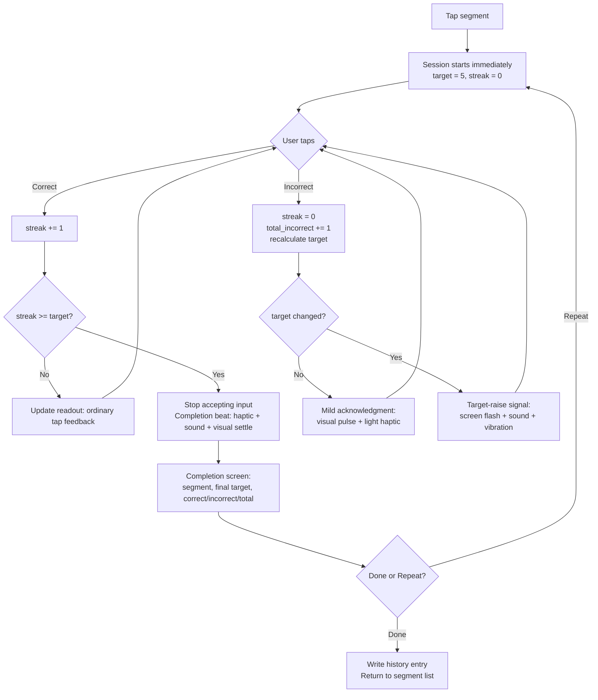
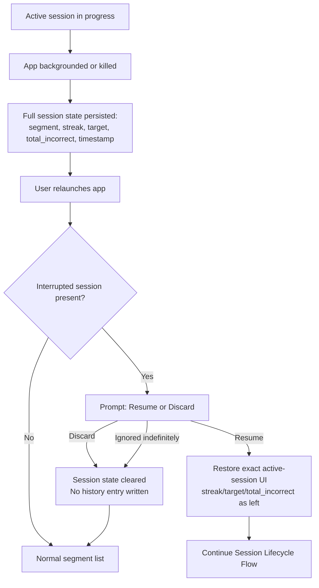

# UX Design Specification Overlearn

**Author:** Gerardo
**Date:** 2026-08-31

---

<!-- UX design content will be appended sequentially through collaborative workflow steps -->

## Executive Summary

### Project Vision

Overlearn is a mobile-first, offline-only app enforcing a live-recalculating, reset-on-miss consecutive-correct-streak mechanic to permanently fix technical practice mistakes for musicians. A session starts immediately at a target of 5 consecutive correct reps; any mistake resets the streak and can raise the target (`max(5, ceil(total_incorrect * 0.5))`). The active session exposes exactly three controls — Correct, Incorrect, confirm-gated Restart — and completes automatically once target is met.

### Target Users

Musicians who already know what they want from practice time — classical guitarists as the beachhead persona (Mara). Not a motivation/gamification audience: they want a rule enforced, not a nudge to practice. Device sits on a stand or table within arm's reach during play, not held. Taps happen in the pause between repetitions, never mid-note — eyes are mostly on sheet music/the instrument, not the screen.

### Key Design Challenges

- **Reach-without-look ergonomics:** controls must be tappable via a quick glance-and-reach from a stand/table — large, edge-anchored, thumb-friendly targets over centered/small ones.
- **Rising-target legibility:** the target can silently climb mid-session (`total_incorrect > 10`); with eyes mostly off-screen, an unsignaled state change risks the user not noticing why the target changed.
- **Restart vs. Correct/Incorrect hierarchy:** Restart is categorically different (confirm-gated, destructive) and must not visually compete with the two no-confirm taps being drilled rapidly.
- **Completion-screen resume gap:** no persisted state exists for "target met, Done/Repeat not yet tapped" — resume behavior if the app is killed there is currently undefined.

### Design Opportunities

- Non-visual/peripheral feedback (haptic pulse, brief color flash) on tap and especially on target-raise, so state changes register without reading text.
- Minimal-chrome active-session screen, resolved as: Correct button anchored top (green, checkmark icon, no text), Incorrect button anchored bottom (red, X icon, no text), streak/target readout (`current/target`, e.g. "4/6") centered between them. Icon-only + color + position gives redundant, glanceable coding without requiring the user to read text.

## Core User Experience

### Defining Experience

The core loop is a single repeated action: tap Correct or Incorrect, without looking, over and over, until the target streak is met. Every other feature (segments, history, interruption recovery) exists to support this one loop. If this tap isn't instant, unambiguous, and reliably capturable without visual confirmation, the product fails at its core value.

### Platform Strategy

Mobile app, iOS and Android, touch-only, fully offline (per PRD Mobile App Specific Requirements — no change from PRD). Device is assumed on a stand/table, not held, per Executive Summary.

### Effortless Interactions

- Correct/Incorrect tap: zero-thought, redundantly coded (position + color + icon), no confirmation.
- Session start: no setup screen, target computed silently.
- Resume/discard prompt: the one unavoidable extra decision on relaunch, but binary and immediate.

### Critical Success Moments

- **Target-raise mid-session** (`total_incorrect_this_session` crosses the >10 boundary): screen flash + sound + vibration, deliberately forceful since the user's eyes are typically off-screen.
- **Session complete:** a distinct but lower-key beat (haptic pulse + short confirmation sound + visual settle) before transitioning to the completion screen — different from an ordinary tap, but intentionally calmer than the target-raise signal, avoiding gamified celebration.
- **Ordinary Correct/Incorrect tap:** minimal feedback only (readout update, light haptic tick) — must not fatigue the user across dozens of reps per session.

### Experience Principles

1. **One loop, zero ambiguity** — the Correct/Incorrect tap is the product; every design choice defers to keeping it instant and glanceable.
2. **Signal strength matches consequence** — feedback intensity scales with how much the user needs to know without looking (ordinary tap < completion < target-raise).
3. **Friction is reserved for destructive or rare actions** — Restart's confirm gate is the only deliberate speed bump in the entire active-session flow.
4. **No motivation mechanics, even in feedback** — sound/haptic/visual cues confirm state changes; they never celebrate, gamify, or nudge.

## Desired Emotional Response

### Primary Emotional Goals

Calm rigor: the app is a strict, honest referee, not a coach or cheerleader. Users should feel they're trusting a rule, not being motivated. The one deliberate exception is session completion, which is allowed to feel genuinely satisfying and warm — a real payoff for real work — without tipping into gamified celebration (no confetti, no badges, no praise copy).

### Emotional Journey Mapping

- **First open / segment creation:** neutral, functional — get out of the way quickly (no upfront input, per FR8).
- **During the core tap loop:** focused, low-friction, unbothered — the user's attention should stay on their instrument, not the app.
- **On a miss (Incorrect tap):** mild acknowledgment, not neutral-to-the-point-of-invisible and not punitive — a small distinct cue (visual reset + light haptic) that registers as "noted, streak reset," never as guilt or failure.
- **On target-raise (mid-session):** alert, attention-grabbing (flash/sound/vibration per Core Experience) — but purely informational, not judgmental.
- **On session completion:** warm satisfaction — the one moment allowed to feel rewarding, via the distinct completion beat (haptic + sound + visual settle) already defined in Core Experience.
- **Returning to use it again:** confident, habitual — no re-onboarding, no nagging to return.

### Micro-Emotions

- **Confidence over confusion:** redundant coding (position/color/icon) on Correct/Incorrect removes any doubt about which control does what.
- **Trust over skepticism:** the target-raise and completion signals must be honest and consistent every time — never randomized or exaggerated, or trust erodes.
- **Accomplishment over frustration:** the no-undo mistake (Journey 3) is accepted friction — frustration there is by design, not something to soften with a mismatched positive cue.
- **Calm over excitement:** explicitly avoid a dopamine-loop feel around the streak count, despite "streak" being the mechanic's name.

### Design Implications

- Calm rigor → flat, low-chrome visual language; no celebratory animation library, no confetti/particle effects anywhere in the app.
- Mild-acknowledgment-on-miss → the Incorrect tap gets a distinct but restrained cue (e.g., brief color pulse + light haptic tick), clearly different from the neutral Correct tap but well short of the target-raise alert intensity.
- Warm-but-not-gamified completion → the completion beat (already speced: haptic pulse + short sound + visual settle) is the ceiling of positive feedback in the entire app — nothing else should approach or exceed it in intensity.
- Trust through consistency → no variability/randomization in any feedback cue; same trigger always produces the same signal.

### Emotional Design Principles

1. **Calm rigor is the default state** — most of the app, most of the time, should feel unremarkable and quiet.
2. **Completion is the one warm moment** — reserve genuine positive feedback intensity for target-met; nowhere else earns it.
3. **A miss is information, mildly marked, never shamed** — acknowledge it distinctly from a hit, but never with punitive framing.
4. **Consistency builds the trust the product depends on** — every signal must be predictable, or the "proof, not feeling" premise breaks down.

## UX Pattern Analysis & Inspiration

Skipped by user directive — no specific inspiring products were provided. Design decisions in this document proceed from the Core User Experience and Desired Emotional Response sections directly, without external pattern borrowing.

## Design System Foundation

### 1.1 Design System Choice

Hybrid: an established component system for standard screens (segment list, segment creation, history log, resume/discard prompt), and a fully custom-built Active Session screen for the core tap loop.

### Rationale for Selection

- Solo-developer project — an established system minimizes maintenance burden and gives WCAG-AA-compliant defaults (NFR6) for free on every screen that doesn't need bespoke behavior.
- The Active Session screen is the one place the product has genuinely unique requirements (top/bottom icon-only buttons, redundant color/position coding, flash/haptic/sound feedback tiers) — no off-the-shelf component covers this, so it's built custom rather than themed.
- Framework choice (React Native vs. Flutter) remains open per the PRD; this decision is framework-agnostic — React Native Paper (Material) or Flutter's Material/Cupertino widgets both satisfy the "established system for standard screens" role equally.

### Implementation Approach

- Standard screens: platform-default components and layout patterns (lists, forms, dialogs) from whichever framework is chosen at the architecture stage.
- Active Session screen: custom-built, full-bleed layout — Correct button (top), streak/target readout (center), Incorrect button (bottom) — with custom feedback handling for tap/miss/target-raise/completion tiers defined in Core Experience and Desired Emotional Response.
- Resume/discard prompt (FR24): standard system dialog/modal component — it's a simple binary choice, no custom treatment needed.

### Customization Strategy

- Color: green (Correct) / red (Incorrect) locked in by user direction; rest of the palette (background, neutral text, alert-flash color for target-raise) to be defined when visual design tokens are established (later step or architecture stage).
- No icon set has been chosen yet — checkmark/X icons for Correct/Incorrect need a source (platform-native icon font vs. custom SVG), to be resolved during implementation.
- Standard-screen components stay unthemed/default wherever possible, to keep the "no invented UI" footprint minimal per solo-dev maintenance constraints.

## 2. Core User Experience

### 2.1 Defining Experience

*"Tap Correct or Incorrect until the streak holds."* This is what a user would tell a friend — a repetitive, judgment-free tap loop that only ends when the required consecutive-correct count is actually met, with the required count itself climbing if the passage proves harder than assumed.

### 2.2 User Mental Model

Musicians already count reps informally ("let me play that 5 times in a row correctly"). Overlearn's model matches that instinct exactly, just enforced and unforgeable — no self-negotiating "close enough" the way an unaided tally does. No education needed; it's a formalization of something they already do in their head.

### 2.3 Success Criteria

- User never has to think about *how* to log a rep — tap position is muscle memory within one session.
- User always knows current progress via the `current/target` readout (e.g., "4/6") without needing to interpret anything.
- A miss never requires a decision — it's an instant, deterministic reset (FR18), no dialog, no "are you sure."
- Completion is unambiguous and automatic (FR12) — the user never has to declare "I'm done," the system decides.

### 2.4 Novel UX Patterns

Established interaction pattern (two-button tap-to-log, familiar from tally counters/scorekeeping apps), applied to a genuinely novel mechanic (live-recalculating target with reset-on-miss). No new interaction vocabulary to teach — the *rule* is new, not the *gesture*.

### 2.5 Experience Mechanics

1. **Initiation:** User taps a segment, session begins immediately at target 5 — no setup screen (FR8, FR9).
2. **Interaction:** User taps Correct (top, green, checkmark) or Incorrect (bottom, red, X) after each attempt. `current/target` readout updates instantly (<100ms, NFR1).
3. **Feedback:**
   - Correct: readout increments, minimal/light feedback (ordinary tap tier).
   - Incorrect: streak resets to 0, mild distinct acknowledgment (visual pulse + light haptic), total-mistakes ticks up, target silently recalculates.
   - **Target-raise** (when recalculation actually changes the number, i.e., `total_incorrect_this_session` crosses past 10): screen flash + sound + vibration — the readout's denominator visibly changes (e.g., "0/5" → "0/6"), and this forceful multi-channel signal is what makes that change legible without reading the screen.
   - Restart: confirm dialog first ("Restart session? Progress will be lost."), then all four fields reset and the screen returns to "0/5" as if session just started.
4. **Completion:** The moment `current_streak >= target_streak`, input stops accepting taps (FR22), the completion beat fires (haptic + sound + visual settle), and the screen transitions to the Completion summary (segment name, final target, total correct + incorrect, total attempts) with Done/Repeat actions (FR13–FR15).

**Restart placement/hierarchy:** Restart sits below the Incorrect button, visually smaller and lower-contrast than the two primary buttons — it reads as a subordinate utility action, not a third peer control, and its confirm-gate is the only friction point in the entire active-session flow.

**Completion-screen resume state:** the completion screen is not a modal overlay on top of the active session — it *is* the next screen state. If the app is killed while it's showing, on relaunch the persisted session state should already reflect `session_complete = true` (a field the Mechanic Specification already defines), so the app can restore directly to the completion screen rather than the resume/discard prompt. Architecture note: `session_complete` must be persisted synchronously as part of the same write that sets the final streak, not as an afterthought.

## Visual Design Foundation

### Color System

- **Background:** near-black neutral (`#121212`-range dark surface) as the default — a dark, quiet canvas reads as calm/focused rather than energetic, and reduces glare/eye strain when the device sits on a stand at arm's length in a dim practice room. Light mode as a secondary/system-following option, not the primary design target.
- **Correct:** green (locked by user direction) — semantic "go/pass," used only for the Correct button and its brief tap feedback.
- **Incorrect:** red (locked by user direction) — semantic "stop/reset," used only for the Incorrect button and its mild acknowledgment pulse.
- **Target-raise alert:** a third, distinct accent (proposed: amber/yellow) reserved exclusively for the screen-flash on target-raise — must not overlap visually with either Correct-green or Incorrect-red, so the three signals stay unambiguous from each other.
- **Neutral text/UI:** desaturated gray scale for the streak/target readout, segment names, history log — deliberately unremarkable, consistent with "calm rigor is the default state."
- **Restart control:** low-contrast neutral gray, intentionally recessive relative to the green/red buttons, reinforcing its subordinate hierarchy.
- **Accessibility:** all color pairings meet WCAG AA contrast (NFR7 requires no reliance on color alone — Correct/Incorrect are already redundantly coded by position + icon shape, so color is reinforcement, not the sole signal).

### Typography System

- **Tone:** plain, functional, non-decorative — no display/brand typeface, system default (San Francisco / Roboto) is sufficient and keeps the "referee, not coach" feel.
- **Type scale:** large numeral display for the `current/target` readout (the single most-read piece of text in the app, must be legible at a glance from arm's length); standard body/label sizes elsewhere (segment names, history rows, dialog text).
- **Content volume:** minimal throughout — no long-form text anywhere in the app; this keeps typography secondary to color/icon/position as the primary communication channels.
- **Accessibility:** support OS-level dynamic type/font scaling; large-numeral readout must remain legible even at larger accessibility text sizes.

### Spacing & Layout Foundation

- **Base unit:** 8px grid, standard for both Material and Cupertino conventions — keeps the standard-screen components (per Design System Foundation) unthemed and consistent with platform defaults.
- **Active Session screen:** airy, full-bleed — Correct button occupies the top ~40% of the screen, Incorrect the bottom ~40%, streak/target readout centered in the remaining ~20%. Large touch targets (well above the 44×44pt NFR6 minimum) intentionally oversized for reach-without-look tapping, not just compliance.
- **Standard screens:** conventional list/form density from the chosen platform's default components — no custom spacing system needed there.

### Accessibility Considerations

- NFR6 (44×44pt minimum touch targets): Active Session buttons vastly exceed this by design; standard-screen components inherit it from the established system.
- NFR7 (no color-alone distinction): Correct/Incorrect already redundant via position + icon; target-raise alert is redundant via flash + sound + vibration, not color alone.
- Dark-mode-primary design must still pass contrast checks against light-mode/system-following fallback, not just the primary dark theme.

## Design Direction Decision

### Design Directions Explored

Given how much of the Active Session screen was already locked by prior steps (button positions, colors, dark background, layout proportions), a divergent multi-direction exploration wasn't appropriate. Instead, a single focused HTML mockup of the Active Session screen was built at `_bmad-output/planning-artifacts/ux-design-directions.html`, implementing the locked layout with interactive previews of the four feedback states: ordinary tap, incorrect mild pulse, target-raise flash, and session completion.

### Chosen Direction

Confirmed as-is: Correct button top (green, checkmark, no text) occupying ~40% of screen height; Incorrect button bottom (red, X, no text) occupying ~40%; centered readout zone (~20%) showing `current/target` (e.g., "4/6") and the segment name; Restart as a small, low-contrast pill anchored to the bottom edge, visually subordinate to the two primary buttons. Dark near-black background throughout.

### Design Rationale

Matches every constraint established in Core User Experience, Desired Emotional Response, and Visual Design Foundation: redundant coding (position + color + icon) for zero-thought tapping, restrained/recessive Restart to preserve its subordinate hierarchy, and a completion screen that reads as a genuine but non-gamified state change (single checkmark icon, plain stats, Done/Repeat actions) rather than celebratory UI.

### Implementation Approach

The HTML mockup's structure (button sizing ratios, color values, animation timing for pulse/flash) can be used directly as a reference during implementation of the Active Session screen described in Design System Foundation. No further visual exploration needed before moving to detailed screen-by-screen flows.

## User Journey Flows

### Session Lifecycle Flow (Journeys 1 & 3 — Happy Path + No-Undo Mistake)



No undo affordance exists on the Correct/Incorrect tap itself (FR19) — an accidental Incorrect tap (Journey 3) follows the same `K` branch as a genuine miss; there is no alternate recovery path, by design.

### Interruption & Resume Flow (Journey 2)



Per NFR4, the app must never silently resume or silently discard — step `E→G` is mandatory whenever an interrupted session exists, with no timeout-based auto-decision.

### Restart Flow (Journey 4)

```mermaid
flowchart TD
    A[Active session in progress] --> B[User taps Restart<br/>small, low-contrast, bottom-anchored]
    B --> C[Confirm dialog:<br/>"Restart session? Progress will be lost."]
    C -->|Cancel| A
    C -->|Confirm| D[All four fields reset:<br/>streak=0, total_incorrect=0, target=5, start_timestamp=now]
    D --> E[Screen returns to fresh session state: 0/5]
    E --> A
    C -.->|No history entry written, no partial record| F[N/A — nothing persisted from the discarded attempt]
```

### Journey Patterns

- **Two-tier confirmation model:** Correct/Incorrect never confirm (FR19 constraint drives zero friction); Restart always confirms (FR21) — the confirm gate is reserved exclusively for state-destroying actions.
- **State-first persistence:** every transition in the Session Lifecycle and Restart flows writes to persisted state before/alongside the UI update, so the Interruption flow can always recover an exact snapshot rather than an approximation.
- **History-write is terminal-only:** across all three flows, the *only* path that writes a history entry is `Done` after a genuine completion (`I -->|Done|` in the Session Lifecycle flow). Discard, Restart, and app-kill-without-resume all bypass history entirely — this is consistent, not an edge case per flow.

### Flow Optimization Principles

- **Minimize steps to the core loop:** zero steps between tapping a segment and being able to log the first repetition (no setup screen).
- **Reduce cognitive load at the one unavoidable decision:** the resume/discard prompt is binary, immediate, and un-skippable — no secondary options to weigh.
- **Feedback intensity signals flow position:** ordinary tap (quietest) → miss (mild) → target-raise (loud) → completion (distinct-but-calm) — the flows above show these are the only four feedback tiers in the entire app, keeping the vocabulary small and learnable.
- **Error recovery is asymmetric by design:** Correct/Incorrect taps have zero recovery path (accepted friction, per Journey 3); Restart is the recovery mechanism for an entire bad session, not for a single mistaken tap.

## Component Strategy

### Design System Components

From the established system (React Native Paper / Flutter Material-Cupertino, per Design System Foundation), used unthemed wherever possible:

- List component (segment list)
- Text input / form fields (segment creation/rename)
- Standard dialog/modal (resume vs. discard prompt, Restart confirm)
- Basic navigation (segment list ↔ segment history ↔ active session)
- Swipe-actions or menu (delete on a segment row)
- Simple list/table rows (history log entries)

### Custom Components

#### Active Session Control Pair (Correct / Incorrect buttons)

**Purpose:** The core repeated-tap interaction — log a repetition as correct or incorrect.
**Content:** No text; a single icon each (checkmark, X).
**Actions:** Single tap, no long-press/secondary actions.
**States:** default, brief tap-feedback (color pulse per Correct — minimal; per Incorrect — mild pulse), disabled (once session completes, per FR22).
**Variants:** None — fixed size/position across all sessions (top ~40% / bottom ~40% of screen).
**Accessibility:** Large touch target well above 44×44pt minimum (NFR6); accessible label "Correct" / "Incorrect" for screen readers, since the button itself carries no text.

#### Streak/Target Readout

**Purpose:** Shows live progress (`current/target`, e.g. "4/6") and segment name.
**Content:** Two numerals + separator + segment name label.
**Actions:** None — display-only, no tap target.
**States:** default, target-raise flash (screen-wide, triggers when the denominator changes), settle state on completion.
**Variants:** None.
**Accessibility:** Large numeral text scales with OS dynamic type; screen-reader announcement on target change (not just visual flash) so the signal reaches non-visual users too.

#### Restart Control

**Purpose:** Full in-progress-session reset, confirm-gated.
**Content:** "Restart" label (this is the one active-session control that does use text, since it's a lower-frequency, higher-stakes action where a label reduces misclicks).
**Actions:** Tap → opens confirm dialog (standard design-system dialog, not custom).
**States:** default (low-contrast/recessive), pressed.
**Variants:** None.
**Accessibility:** Meets 44×44pt minimum despite its visually smaller footprint (padding compensates for the minimum touch target).

#### Feedback Signal System (cross-cutting, not a visual component)

**Purpose:** Coordinates the four feedback tiers (ordinary tap, incorrect pulse, target-raise flash, completion beat) across visual (color/flash), haptic, and audio channels consistently.
**States:** the four tiers defined in Core User Experience and Desired Emotional Response — this is implemented as shared logic, not a UI widget, but is specified here because every custom component above depends on it firing consistently.

### Component Implementation Strategy

- Build the four custom components/behaviors above using the design tokens from Visual Design Foundation (colors, spacing, type scale) so they stay visually coherent with the design-system-driven standard screens.
- Standard screens receive zero custom component work — the entire component-design effort concentrates on the Active Session screen, consistent with the hybrid Design System Foundation decision.
- Feedback Signal System is implemented once, centrally, and invoked from all four tap/state-change points — avoids drift between "what the mockup shows" and "what actually fires" per interaction.

### Implementation Roadmap

**Phase 1 — Core Components (blocking for MVP):**
- Correct/Incorrect button pair
- Streak/Target readout
- Feedback Signal System (all four tiers)

**Phase 2 — Supporting Components (needed for MVP but lower risk):**
- Restart control + confirm dialog
- Resume/discard prompt (standard dialog)
- Completion screen (standard layout + custom completion beat trigger)

**Phase 3 — Standard CRUD (lowest risk, design-system-only):**
- Segment list, creation form, delete action
- History log list

## UX Consistency Patterns

### Button Hierarchy

- **Primary (session-critical):** Correct, Incorrect — full-size, color-coded, icon-only, always visible during an active session, no confirmation.
- **Secondary/utility (destructive, gated):** Restart — small, low-contrast, text-labeled, always confirm-gated.
- **Standard actions (design-system default):** Done, Repeat, Resume, Discard, segment CRUD actions — use platform-default button styling; primary action (e.g., Repeat, Resume) visually emphasized over secondary (Done, Discard) per platform convention, no custom treatment needed.

### Feedback Patterns

Four tiers only, applied consistently everywhere they occur (defined in Core User Experience, Desired Emotional Response, Component Strategy):

| Tier | Trigger | Signal |
|---|---|---|
| Ordinary | Correct tap | Minimal — readout increments, light haptic tick |
| Mild | Incorrect tap (no target change) | Visual pulse + light haptic |
| Alert | Incorrect tap causing target-raise | Screen flash + sound + vibration |
| Distinct | Session completion | Haptic pulse + short sound + visual settle |

No fifth tier is introduced anywhere else in the app (e.g., segment creation, delete) — those use plain design-system default feedback (e.g., a standard toast/snackbar or instant list update), since they carry no gameplay weight.

### Form Patterns

Only one form exists: segment creation/rename (a single text field, name only). Standard design-system input component, standard inline validation (non-empty name), no multi-step or complex validation logic — consistent with No-Invention Rule (no fields beyond what FR1 requires).

### Navigation Patterns

- **Structure:** flat, three-level — Segment List (home) → Segment Detail (history + Start action) → Active Session / Completion.
- **No tab bar, no drawer, no deep hierarchy** — the app's scope (FR1–FR29) doesn't warrant one; a simple stack/push navigation is sufficient.
- **Active Session is a dead-end screen with one exit** — completion (automatic) or backgrounding (interruption flow); there's no manual "back" out of an active session other than backgrounding, since abandoning mid-session is handled by the interruption/discard flow, not a nav action.

### Additional Patterns

- **Modal/overlay pattern:** used only for the two confirm-style interruptions in the entire app — Restart confirm and Resume/Discard prompt. Both use the standard design-system dialog component; no custom modal styling.
- **Empty state:** segment list with zero segments shows a prompt to create the first one (FR7) — standard empty-state pattern (icon/message + primary CTA), design-system default.
- **Loading states:** not applicable in any meaningful way — the app is fully offline/local, so no network loading states exist anywhere (per NFR8, zero data leaves the device).
- **Search/filtering:** not applicable — no PRD requirement calls for it, and inventing one would violate the No-Invention Rule.

## Responsive Design & Accessibility

### Responsive Strategy

Mobile phones only — no tablet or desktop target (per PRD Mobile App Specific Requirements). "Responsive" here means adapting across the range of phone screen sizes and aspect ratios (small phones to large phones/phablets), not across device classes.

- **Active Session screen:** the top-40%/center-20%/bottom-40% proportional layout scales naturally with any phone screen height — no fixed pixel heights, so it holds up from compact to large phones alike.
- **Standard screens:** inherit responsive behavior from the design system's default components — no custom work needed.
- **Orientation:** portrait-primary, consistent with device-on-a-stand usage (per Executive Summary); landscape support is not a stated requirement and is not designed for in this pass — flagged as an open question for architecture/implementation if it needs explicit locking vs. graceful reflow.

### Breakpoint Strategy

Not applicable in the traditional sense — no tablet/desktop breakpoints exist for this project. The only "breakpoint" consideration is ensuring the Active Session screen's proportional (percentage-based) layout remains legible and touch-target-compliant (NFR6) across the smallest supported phone screen to the largest.

### Accessibility Strategy

**Compliance level:** WCAG 2.1 AA, per NFR6 and NFR7 — already the PRD's explicit bar, not a new decision.

**Key considerations, mapped to this app's actual surface:**
- Touch target size: 44×44pt minimum (NFR6) — Active Session buttons vastly exceed this; standard-screen components inherit it from the design system.
- No color-alone distinction (NFR7): Correct/Incorrect already redundant via position + icon shape + color; target-raise alert redundant via flash + sound + vibration.
- Screen reader support: accessible labels on icon-only buttons (Correct/Incorrect), and the target-raise/completion signals need a screen-reader-audible equivalent (announcement), not just a visual flash — carried over from Component Strategy.
- Dynamic type: streak/target readout and all text must scale with OS font-size settings without breaking layout.
- Color contrast: dark-background palette (Visual Design Foundation) must meet 4.5:1 for normal text against the near-black background.

**Out of scope:** keyboard navigation and desktop screen-reader patterns are not applicable — this is a touch-only mobile app with no keyboard input path except the single segment-name text field.

### Testing Strategy

- **Device testing:** a small range of physical/simulated phone sizes (compact to large), given solo-dev resource constraints — no dedicated device lab.
- **Accessibility testing:** platform-native screen reader (VoiceOver on iOS, TalkBack on Android) pass on the Active Session screen specifically, since it's the one screen with custom, non-standard components; standard screens inherit accessibility from the design system and need lighter verification.
- **Manual verification:** touch-target size and color-contrast checks against NFR6/NFR7 before each release, given no automated a11y pipeline is assumed for a solo-dev offline app.

### Implementation Guidelines

- Use relative/proportional units for the Active Session screen layout (percentage-of-screen-height, not fixed pixels) so it holds across phone sizes.
- Respect OS dynamic type settings for all text; avoid fixed font sizes that block scaling.
- Implement accessible labels (`accessibilityLabel` / `contentDescription`) on all icon-only custom buttons.
- Implement the target-raise and completion audio/haptic/visual signals with a parallel screen-reader announcement path, not purely visual/auditory.
- No landscape-specific layout is required for MVP; simplest approach (lock portrait, or let standard screens reflow naturally) deferred to architecture/implementation decision.
